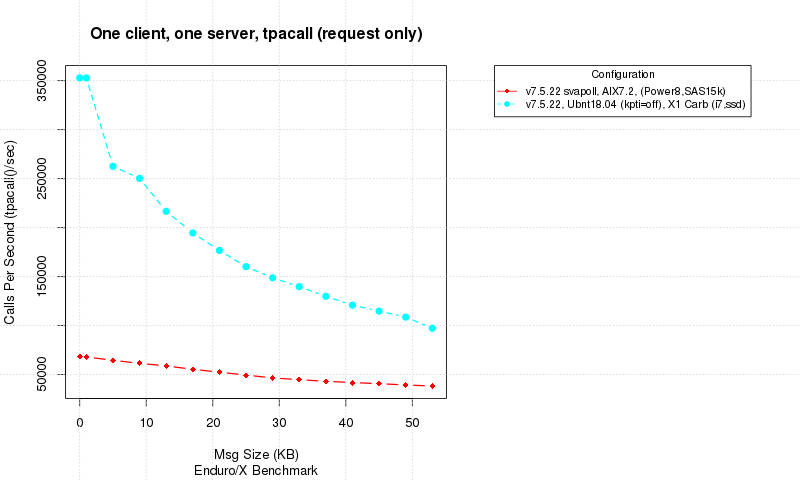
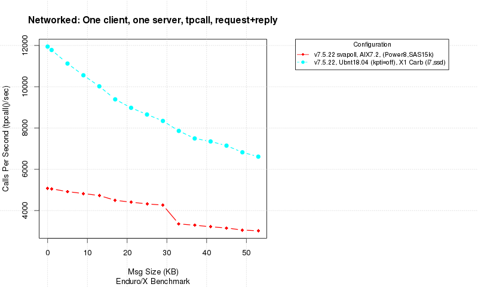
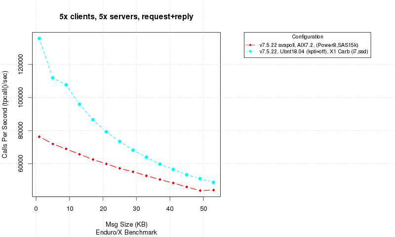

Enduro/X benchmarks
===================
Madras Vitolins
v1.0, 2016-07:
	Initial draft
:doctype: book

Overview
--------
This document generally contains Enduro/X benchark overview, performed on different platforms.
Different aspects are being tested and performance results are analyzed. Testing will cover
funamental message exchange between client and server, synchrouns and asynchrouns aspects are tested.
Document also covers persistent storage benchmarks.

Asynchrouns tpacall()
---------------------
This tests uses one way calls to the server process. At the end of the calls it is ensured that
all messages are processed by server. Only then results are plotted.

Local tpcall()
--------------
This test includes locally running ATMI client and ATMI server. The interprocess comunication happens
with help of kernel queues (kq) or shared memory (shm). The polling mechanisms are either epoll() (works
 on linux, most efficient way) and usual poll() for which event chain is bit longer.

From the results can be seen that performance mostly stays stable at different data size loads.

Networked tpcall()
------------------
At this test basically same works is done as for above, but instead two instances of application servers
are started and they are interconnected with network.

Here we see that network peformance slightly fluctate. That could be related with fact now bridge is involved to transfer
the message over the network, and process count is bigger than CPU core count. Thus scheduler comes in work.

Multi-process/multi-thread tpcall()
-----------------------------------
This test cases employs five ATMI servers, and one ATMI client which inside have 5x threads,
sending messagas to the servers

Persisted storage benchmark, tpenqueue()
----------------------------------------
This test gets much lower results, because all messages are being saved to disk. Also note that internally
Enduro/X uses distributed transaction manager to coordinate the save of the message, thus processing of 
XA transaction takes some disk resources too.

Running the benchmarks
----------------------
It is possible to run benchmarkings on your ownsystem. Note that for chart plotting R language is used. If R will not
be installed, then charts will not be generated. But results still can be read from data files. Benchmark script is
located in 'doc/benchmark' folder, named 'build.sh <configuration name>'. The configuration name is arbritrary description
of your system on which you perform tne tests. Shall not contain spaces. Results are plotten into text files located
in same directory.

NOTE: That you must enable the Q message size up till 56000 bytes. On Linux system that would mean that '/etc/rc.local' needs to be set to:

---------------------------------------------------------------------
...
echo 56000 > /proc/sys/fs/mqueue/msgsize_max
...
---------------------------------------------------------------------

And in 'setndrx' we shall also enable that message size:

---------------------------------------------------------------------
...
# Max message size (in bytes)
export NDRX_MSGSIZEMAX=56000
...
---------------------------------------------------------------------

For our sample user (user1), then running could look like:

---------------------------------------------------------------------
$ cd /home/user1/endurox/doc/benchmark
$ ./build.sh my_system,linux,ssd
$ ls -1
01_tpcall.png
01_tpcall.txt
02_tpcall_dom.txt
02_tpcall_network.png
03_tpcall_threads.png
03_tpcall_threads.txt
04_tpacall.png
04_tpacall.txt
05_persistent_storage.png
05_persistent_storage.txt
build.sh
genchart.r
---------------------------------------------------------------------

:numbered!:

[bibliography]
Additional documentation 
------------------------
This section lists additional related documents.

[bibliography]
.Internet resources
- [[[ATMI-API]]] http://docs.oracle.com/cd/E13203_01/tuxedo/tux71/html/pgint6.htm

[glossary]
Glossary
--------
This section lists

[glossary]
ATMI::
  Application Transaction Monitor Interface

UBF::
  Unified Buffer Format it is similar API as Tuxedo's FML

////////////////////////////////////////////////////////////////
The index is normally left completely empty, it's contents being
generated automatically by the DocBook toolchain.
////////////////////////////////////////////////////////////////
