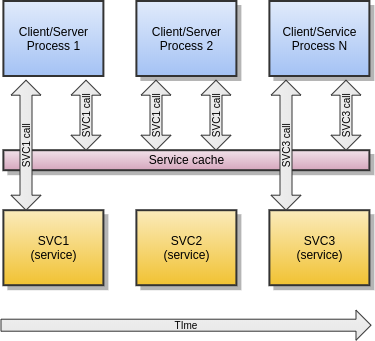

Enduro/X Administration Manual
==============================
Madars Vitolins
v1.0, 2012-12:
	Initial draft
:doctype: book

== How to configure Enduro/X
To configure Enduro/X you have to finish several steps.

- Have a separate system user for each Enduro/X instance.

- Setup System Environment (mount mq file system, configure mq params)

- Setup environment configuration

- Setup 'ndrxdconfig.xml'

- Setup 'ndrxdebug.conf'

- Startup the application

== Setup System Environment

Enduro/X supports different back-end message transports. Following mechanisms
are available:

- EPOLL (for FreeBSD it is Kqueue) over the Posix queues. This is fastest and
most preferred transport mechanism when available. True on queue multiple
servers mechanism is supported for different services across different XATMI
server binaries (transport code "epoll" for GNU/Linux and "kqueue" for FreeBSD).

-  System V message queues, this is generally second best transport available
on Linux and Unix operating systems. One queue multiple servers mechanism is
available via Request Address option (rqaddr) for XATMI server. The limitation is that
each server running on same request address *MUST* provide all services provided
by other servers in same Request Address. This mechanism uses at-least one 
additional thread per XATMI participant for handling message send/receive time-outs.
In case if XATMI server, additional more thread is used for administrative message
handling and dispatching to main server thread. Thus compiler must support
the multi-threaded operations for user applications (transport code "SystemV").

- The third option if POLL over the Posix queues. This uses round-robin approach
for message delivery to load balanced servers. One additional thread is used
for server process to monitor queues (transport code "poll").

- The forth option is emulated message queue which uses shared memory and process
shared Posix locks to emulate the mssage queue (transport code "emq").

.Enduro/X IPC transport sub-systems
[width="80%",cols="^2,^2,^2,^2,^2,^2",options="header"]
|=========================================================
|Operating System/IPC Transport|epoll |kqueue |systemv |poll |emq 
|GNU/Linux|R |X |R |S |S 
|FreeBSD|X |R |S |S |S 
|IBM AIX|X |X |R |S |S 
|Oracle Solaris|X |X |R |S |S
|MacOS|X |X |X |X |R 
|=========================================================

Legend:

'S' - supported.

'R' - supported and release provided.

'X' - not supported.

Each of these IPC transports for particular operating system requires specific
approach for configuring the limits and other attributes for runtime.

Note that transport version is built into Enduro/X distribution. Thus to change
the IPC transport, different Enduro/X version must be installed (i.e. cannot
be changed by parameters). As the ABI for user apps stays the same, the user
application is not required to be rebuilt.

=== Release file format

The release file for Enduro/X encodes different information

== Linux setup

In this chapter will be described typical GNU/Linux system configuration required
for Enduro/X. Server Posix queue parameters must be set-up:

Typical configuration would look like (normally you can put this in /etc/rc.local):

--------------------------------------------------------------------------------
# Mount the /dev/mqueue
mkdir /dev/mqueue
mount -t mqueue none /dev/mqueue
echo 32000 > /proc/sys/fs/mqueue/msg_max
echo 10000 > /proc/sys/fs/mqueue/msgsize_max
echo 10000 > /proc/sys/fs/mqueue/queues_max
--------------------------------------------------------------------------------

Which means:

- 'msg_max' - Maximum number of messages in queue (32K)

- 'msgsize_max' - Maximum message size, ~10KB (System limited, for example for linux 
kernel 3.13 and later this can reach up to 10MB)

- 'queues_max' - Maximum number of queues (10K)

See <<MQ_OVERVIEW>> for more details about Posix queues on GNU/Linux.

Also do not remember to update Enduro/X environment variables to reflect these
settings. Variables like:

- 'NDRX_MSGMAX'

- 'NDRX_MSGSIZEMAX'

See <<EX_ENV>> for more configuration flags.

Update also should be done to system security configuration. I.e. update to
'/etc/security/limits.conf' is required, following lines must be added:

--------------------------------------------------------------------------------
*               soft    msgqueue        -1
*               hard    msgqueue        -1
--------------------------------------------------------------------------------

Setup environment configuration
-------------------------------
Enduro/X depends lot of Environment variables. See manpage of 'ex_env' (<<EX_ENV>>)
to see all paramters that must be setup. There is also sample configuration
provided. Normally it is expected that seperate shell script file is setup containing
all paramters. Then to load the environment, login with Enduro/X user in, and run
following command in your app dir, for example:
--------------------------------------------------------------------------------
$ cd /endurox/app/conf
$ . setapp
--------------------------------------------------------------------------------

Setup 'ndrxdconfig.xml'
-----------------------
Vital part of Enduro/X is 'ndrxdconfig.xml' config. Full path to it is configured
in 'NDRX_CONFIG' environment variable.
To see how to setup see manpage of it <<NDRXCONFIG>>.

Setup 'ndrxdebug.conf'
----------------------
Environment variable 'NDRX_DEBUG_CONF' contains full path to debug file. 
See <<DEBUGCONF>> for more details about 'debug.conf' setup.

Start Enduro/X application
-------------------------
To start the Enduro/X application, login with Enduro/X instance user, and issue
following command 'xadmin start', for example:

--------------------------------------------------------------------------------
$ xadmin start -y
ndrxd PID (from PID file): 25037
exec tpevsrv -k 0myWI5nu -i 14 -e /tmp/TPEVSRV -r --  :
	process id=26793 ... Started.
exec tpbridge -k 0myWI5nu -i 101 -e /tmp/BRIDGE002 -r -- -n2 -r -i 0.0.0.0 -p 4433 -tP -z30 :
	process id=26794 ... Started.
exec tpbridge -k 0myWI5nu -i 102 -e /tmp/BRIDGE012 -r -- -n12 -r -i 10.10.10.2 -p 14433 -tA -z30 :
	process id=26795 ... Started.
Startup finished. 3 processes started.
--------------------------------------------------------------------------------

To see all commands available by 'xadmin' (xa) see manpage of it <<XADMIN>>.

Recovery from crashed local ATMI monitor
----------------------------------------
Enduro/X is capable to continue with out restart in case if 'ndrxd' local ATMI
monitor is crashed or contains invalid data structures for some reason. In this
case administrator can do following:

- $ kill -9 <ndrxd PID>
- remove ndrxd queue, for example: $ rm /dev/mq/n00b,sys,bg,ndrxd
- restart 'ndrxd' in learning mode, by: $ nohup ndrxd -k $NDRX_RNDK -r 

Cluster configuration
---------------------
To setup cluster see you have to setup bridge ATMI processes on each of the machines.
See <<TPBRIDGE>> documentation to have understanding of clustering. Sample setup of
cluster node which activetly connects to Node 2 and waits call from Node 12 could
look like:

--------------------------------------------------------------------------------
<?xml version="1.0" ?>
<endurox>
	<appconfig>
		<sanity>10</sanity>
		<brrefresh>6</brrefresh>
		<restart_min>1</restart_min>
		<restart_step>1</restart_step>
		<restart_max>5</restart_max>
		<restart_to_check>20</restart_to_check>
	</appconfig>
	<defaults>
		<min>1</min>
		<max>2</max>
		<autokill>1</autokill>
		<respawn>1<respawn>
		<start_max>2</start_max>
		<pingtime>1</pingtime>
		<ping_max>4</ping_max>
		<end_max>3</end_max>
		<killtime>1</killtime>
	</defaults>
	<servers>
		<!-- Connect to cluster node 2, we will wait for call -->
		<server name="tpbridge">
			<max>1</max>
			<srvid>101</srvid>
			<sysopt>-e /tmp/BRIDGE002 -r</sysopt>
			<appopt>-n2 -r -i 0.0.0.0 -p 4433 -tP -z30</appopt>
		</server>
		<!-- Connect to cluster node 12, we try to connect activetly to it -->
		<server name="tpbridge">
			<max>1</max>
			<srvid>102</srvid>
			<sysopt>-e /tmp/BRIDGE012 -r</sysopt>
			<appopt>-n12 -r -i 195.122.24.13 -p 14433 -tA -z30</appopt>
		</server>
	</servers>
</endurox>
--------------------------------------------------------------------------------

Max message size and internal buffer sizes
------------------------------------------

Starting from Enduro/X version 5.1+, the max message size what can be transported
over the XATMI sub-system is limited to the operating system's queue settings.
For example on Linux kernel 3.13 the message size limit (/proc/sys/fs/mqueue/msgsize_max)
is around 10 MB. The message size is configured with 'NDRX_MSGMAX' environment
variable, see ex_env(5) man page.

Also what should be noted, as Enduro/X mostly uses stack allocation
instead of heap allocation (for safer and faster code), then there are requirements
against the stack size. The stack size (ulimit -s) must be at least size of message
multiplied with 30. So for example if message size is set to 1 MegaByte, then stack
size shall be set to 30 Mega bytes (ulimit -s 30720 KB). If the stack is not sufficient
the following error will be print when attempting to run any Enduro/X based software:

--------------------------------------------------------------------------------
Logging to ./ULOG.20171112
Failed to open [./ULOG.20171112]
 9138:20171112:19144166:xadmin      :LIMITS ERROR ! Please set stack (ulimit -s) size to: 1966080 bytes or 1920 kb (calculated by: NDRX_MSGSIZEMAX(65536)*NDRX_STACK_MSG_FACTOR(30))

LIMITS ERROR ! Please set stack (ulimit -s) size to: 1966080 bytes or 1920 kb (calculated by: NDRX_MSGSIZEMAX(65536)*NDRX_STACK_MSG_FACTOR(30))
Process is terminating with error...
--------------------------------------------------------------------------------

In this case stack size needs to be increased, that could be done by in multiple
ways:

1. Change by $ ulimit -s 1920
To ensure that this is set each time the Enduro/X is started, it needs to be 
added to the "env" script of the application which prepares application
environment before app boot. Also system settings must be checked in
'/etc/security/limits.conf' either the limit is enough - "stack" parameter.

2. Set the user/system limit directly in '/etc/security/limits.conf'.
For other operating systems, please consult with corresponding manual for chaning
the message size and stack size.

Also regarding the buffer sizes, when 'NDRX_MSGMAX' is set bellow 64K, the buffer
size is fixed to 64K, this means that operations like network packet size when
using tpbridge, is set to 64K.

As the message size is in the same time a internal buffer size, this means that
not all space can be used by sending some data (for example CARRAY or UBF buffer).
Some overhead is added by Enduro/X, message headers, for bridge protocol format
extra data is added for TLV structure. Thus to be safe, for example if expected
data size is 64K, then message size should be set to something like 80KB.

== Enduro/X Smart Cache

Enduro/X support SOA level cache. This means that administrator can configure
system configuration, so that certain services are cached. Thus if some client
process calls some service X, and it gets valid results back, then data key is
built (specified in config) and for this key data is saved to 
Lightning Memory-Mapped Database (LMDB). Next time service is called, the cache
is checked, again, key is built, and lookup to LMDB is made. If results are found
in db, then actual service is X is not called, but instead saved buffer from
cache is returned back to caller. Cache works for tpcall() function.

Cache supports different features:

. Limited or unlimited caches are available. The unlimited cache is bound to
physical dimensions of db file (also specified in configuration). In case of
limited cache, number of logical items stored in cache can be specified. This is
set by 'limit' parameter for database configuration. In case if limit is specified
the strategy how to remove over-reached records can be specified in database
flags. The strategies supported are following: *LRU* - keep records recently
used, *FIFO* - delete records by chronological order (older records added to
cache are being deleted), *HITS* - records mostly accessed stays in cache.

. Multiple physical storage definitions, so that XATMI services can be allocated
in different or same physical storage. This can help to solve challenges between
storage space limitations and performance limitations (when multiple writes are
done in same physical storage).

. Cache is Enduro/X cluster aware. Records can be distributed and deleted across
the cluster nodes. Time based sync is supported when in the same time both nodes
adds records to non existing cache cell. On both cluster nodes will survive record
which is fresher. The older duplicate is zapped by tpcall() or by tpcached.

. Records can be grouped for example statement pages can be all linked to single
user. If transaction happens for user, then whole group can be invalidated. Thus
build cache again. Grouping can be also used for Denial Of Service (DoS)
protection. Enduro/X can be configured to limit the max number of new records in
group, after which any new non existing data element lookup in group will make
request buffer to reject with configured tperrno, user return code and buffer.

. Records in cache can be cross-invalidated. Meaning that "hooks" can be put on
certain service calls in order to invalidate - zap contents of some other
cache.

. Cache supports refresh conditions. So that in case if specific condition over
the data is true, the cached data not returned, but service invocation is performed
and re-cached (old data overwritten).

=== Limitations of the cache

The LMDB is build in such way that if write transaction on the database is
open, then other writes will not be able to process it in meantime. While read
only transactions are processed, while some other process holds write transaction.
Also if process which is holding the lock is crashed (e.g. segfaul, kill, etc..),
then lock is automatically made free. Thus for example is using *hits* or *lru*
limitation caches, then this automatically means that during the tpcall() chaches
needs to be updated, thus lock is needed, and this means that all callers will
have to sync in that place - thus makes point of bottleneck.

:numbered!:

[bibliography]
Additional documentation 
------------------------
This section lists additional related documents.

[bibliography]
.Internet resources
- [[[ATMI-API]]] http://docs.oracle.com/cd/E13203_01/tuxedo/tux71/html/pgint6.htm
- [[[FML-API]]] http://docs.oracle.com/cd/E13203_01/tuxedo/tux91/fml/index.htm
- [[[EX_OVERVIEW]]] ex_overview.pdf
- [[[MQ_OVERVIEW]]] 'man 7 mq_overview'
- [[[EX_ENV]]] 'man 5 ex_env' or 'ex_env.pdf'
- [[[NDRXCONFIG]]] 'man 5 ndrxconfig.xml'  or 'ndrxconfig.xml.pdf'
- [[[DEBUGCONF]]] 'man 5 ndrxdebug.conf'  or 'ndrxdebug.conf.pdf'
- [[[XADMIN]]] 'man 8 xadmin' or 'xadmin.pdf'
- [[[TPBRIDGE]]] 'man 8 tpbridge' or 'tpbridge.pdf'

[glossary]
Glossary
--------
This section lists

[glossary]
ATMI::
  Application Transaction Monitor Interface

UBF::
  Unified Buffer Format it is similar API as Tuxedo's FML

////////////////////////////////////////////////////////////////
The index is normally left completely empty, it's contents being
generated automatically by the DocBook toolchain.
////////////////////////////////////////////////////////////////
