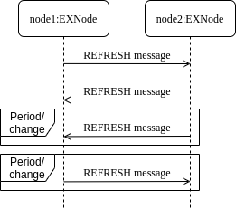

Enduro/X Machine Independent network cluster protocol
=====================================================
:doctype: book

== About manual

This document describes the network data encoding protocol used for connecting
Enduro/X instances between machines of different architectures. Enduro/X is
operating with the same type of machine architectures and operating systems, then
native format network protocol is recommended to be used, which is sending direct
C structures between the Enduro/X instances.

How ever in cases when Enduro/X application is run on different type of machines
and cluster link is needed between those instances, machine independent format
shall be used. This format can activated by setting flag "-f" in *tpbridge(8)*
command line arguments for both end points.

Protocol is constructed as Tag Length Value (TLV) encoded data, where Tag and Length
has fixed length. Data part may be encoded as Binary Coded Decimal (BCD), ASCII
or Binary data.

Protocol by it self operates in asynchronous fashion and is loosely coupled with
the call semantics (i.e. when the reply is required, etc), it is out of the scope
for protocol it self. How ever this document will present basic work flows for
the messaging sessions.

Currently over the one server:port end-point only one TCP/IP socket is handled.
Each end-point represents a node in Enduro/X cluster with configured / unique 
within cluster Node ID.

== Abbreviations

.Used Abbreviations
|=========================================================
|Abbreviation |Description
|BCD | Binary Coded Decimal. The way how numbers are encoded. The decimal number
is encoded in hex representation. It is more compact than ASCII, but still
manageable to debug in hex dump.
|TLV | Tag Length value
|=========================================================

== Physical network connection

To establish physical network connection with Enduro/X application server, asynchronous
socket shall be used. Each message sent in socket is prefixed with 4 bytes length
indicator. The length bytes does not include length bytes by it self, but it indicates
the number of bytes that are part of the incoming message. After the length indicator
bytes the data bytes follows. Length bytes are order in network order, which is 
big-endian. Thus if message length without length bytes are in decimal is 15888, 
then following frame bytes shall be sent: 0x00, 0x00, 0x10, 0x3e.

For keep-a-live, zero length messages are supported. Thus Enduro/X bridge periodically
may be configured to emit the zero length messages. If configured so, bridge will
wait corresponding idle messages too. If not received in configured time, the
connection is restarted.

== Message TLV Encoding rules

Messages are encoded with:

- Two byte TAG which identifies simple data type or complex data structure. Bytes
are encoded in network order big-endian.

- 4 byte (unsigned) data length identifier, also encoded in network order of
big-endian. Length specifies number of is used by data.

- Data block which corresponds to the TAG meaning.

Data alignment is not used for encoded message. When parsing a protocol, any 
un-recognized tags shall be ignored.

== General structures data layout

All the exchanged messages within protocol as is based on the structures principles.
Where we can look on structure like a complex data type. Each structure may
consist of basic data types or complex data types. Which makes messages a
hierarchical tree of the structures. Where leaf structures always consists of
basic data types. This document uses term "block", "complex data typed block", "message blocks" 
and "structures" with the same meaning.

Basically network messages consists of the message blocks. These message blocks
then are constructed basic data types and complex data type blocks.

Typical message layout would be:

image:ex_netproto_msgexample.png[caption="Figure 1: ", title="tpcall() message layout"]

== Basic Data type encoding

This section lists data types used in message protocol and their specifics.

[[numbers-anchor]]
=== Numbers

Numbers in messages are encoded as binary coded decimals. Binary coded decimal
means that value is encoded in ASCII representation of hex value. Thus when analyzing
the message dumps in hex format, the encoded values can be clearly seen. For example
if value of unsigned integer 43219 needs to be transmitted over the protocol,
the number will be encoded in 3 bytes as follows: 0x04,0x32,0x19.

If the number is signed, then last in left-to-right order char encodes the sign. 
"0" is positive or  zero, "1" is negative number. For example having Signed Integer 
type value -717711, it will be encoded as 0x07, 0x17, 0x71, 0x11.

*Floats* and *doubles* are encoded with fixed implied resolution. For Floats 5 digits
decimal fraction is encoded in BCD value. For Doubles 6 digits are encoded in
trailer. So for example, having Double value 654.999812, would be encoded in
BCD as following bytes:x65, x49, x99, 0x81, 0x20 (note as number
is not negative, it is terminated with 0).

Enduro/X may run on 32bit (LP32) and 64bit (LP64) platforms. Some data types differ between
these platforms, particularity *long* and *unsigned long* as they corresponds
to platform bits. Internally Enduro/X uses values which in case
of longs does not go over 32bit values, but user application for example may
send in UBF field 64bit long value. In that particular case C function sscanf()
may overflow if maximum 64bit value is sent to 32bit value. End result is value
which was returned by sscanf().

=== Strings and blobs (Carray)

Strings and blobs are encoded as generic byte array. String data may not contain
0x00 byte, where carray can. The length is encoded in TLV Length component.

[[time-anchor]]
=== Enduro/X time field

Enduro/X internally uses *NTIMER* data type which represents transportation
of number of seconds (20 digits) and number of nanoseconds (20 digits). Thus
Total length of the field is 40 digits, which in BCD is 20 bytes. The "time since"
is relate and exact start time source is specified with the particular field
use.

=== Legend of all data type presentation

For numeric types variable length fields length is specified logical digits. 
For signed numeric types this does not include sign digit. Numeric type length 
does not include zero prefix for BCD in case if odd number of digits are present 
in final BCD representation. 

Field length for strings, blobs (carrays) and sub-structures is specified in
number of bytes.

.List of basic data types
|=========================================================
|Type name |Description
|<Type>..X | Field length (range) form 0 to X.
|<Type>X..Y |  Field length (range) from X to Y.
|<Type>X | Fixed field length (range) X.
|SHORT | Signed short field. 16bit value.
|LONG | Signed long field. 32bit or 64bit value. Depending on platform.
In case if range is specified and upper value is greater than *10*, then
for 32bit platforms this is defaulted to *10*.
|CHAR | One byte ASCII char. Shall not contain 0x00 terminator byte. In that
case field TLV length shall be 0.
|FLOAT | Floating point value. See <<numbers-anchor>> for encoding rules.
|DOUBLE | Double precision value. See <<numbers-anchor>> for encoding rules.
|STRING | String value. May contains all ASCII characters, except 0x00 byte.
|CARRAY | This is blob type, may contain any bytes.
|INT | Signed integer type, 32bit type.
|ULONG | Unsigned long. 32 or 64 bit value. . Depending on platform.
In case if range is specified and upper value is greater than *10*, then
for 32bit platforms this is defaulted to *10*.
|UINT | 32bit usinged integer.
|NTIMER | Time field. seconds and nano-seconds. See <<time-anchor>>. Field is
fixed length of 40 digits.
|USHORT | 16bit unsigned value.
|=========================================================

=== Legend of constants

This section lists any constants used in the document.

.List of basic data types
|=========================================================
|Const name |Description
|PMSGMAX | This is constant number and represents maximum message length. For
Enduro/X it is configured in *NDRX_MSGSIZEMAX* env variable.
|=========================================================

== Complex data type blocks

This section list complex data type blocks which are later incorporated in the
message blocks.

=== Network call block

[[block-netcall]]
*Type code: NETCALL*

All messages sent via protocol starts with this block.

.Network call block
|=========================================================
|TLV TAG | Name | Format | Cond | Default value | Description
|0x1005 |br_magic |LONG10 |Mand |N/A |Network protocol identifier constant. Hex
value is *0x6A12CC51L* which corresponds to decimal value *1779616849* actually
present in message (encoded in BCD)
|0x100F |msg_type |CHAR |MAND |N/A |Network message type. Following values
are supported:

*N* - XATMI Notification message (i.e. call of *tpnotify(3)* or *tpbroadcast(3)*.

*A* - Any other XATMI message (e.g. *tpcall(3)* or reply from *tpreturn(3)*, etc.).

*X* - Administrative message from *ndrxd(8)* or other parts. (i.e. clock sync, 
service table update).

|0x1019 |command_id |INT1..5 |Mand |N/A |Command code within the message type.

Commands of 'msg_type' = *A*:

*1* - tpcall/tpacall message. Message type code *TPCALL*, see <<message-tpcall>>

*2* - tpreturn message. Message type code *TPCALL*, see <<message-tpcall>>

*3* - tpforward message. Message type code *TPCALL*, see <<message-tpcall>>

*4* - tpconnect message. Message type code *TPCALL*, see <<message-tpcall>>

*5* - conversational data. Message type code *TPCALL*, see <<message-tpcall>>

*6* - tpconnect accept reply message from server. Message type code *TPCALL*, see <<message-tpcall>>

*7* - tpdiscon message. Message type code *TPCALL*, see <<message-tpcall>>

Commands for 'msg_type' = *N*:

*13* tpnotify message. Message type code *TPNOTIF*, see <<message-tpnotif>>

*14* tpbroadcast message. Message type code *TPNOTIF*, see <<message-tpnotif>>

Commands for 'msg_type' = *X*:

*46* Service table exchange message. Message type code *REFRESH*, see <<message-refresh>>

*48* bridge, monotonic clock exchange, request. Message type code *TIMESYNC*, see <<message-timesync>>

|0x102D |buf |MESSAGE0..PMSGMAX |Mand |N/A | Message data block which corresponds to msg_type / command_id.
Body described in <<message-anchor>> section.
|=========================================================

=== Standard call block

*Type code: STDHDR*

All messages includes field "stdhdr" where similarly as with network call header
generic details about message is kept.

.Standard call header block
|=========================================================
|TLV TAG | Name | Format | Cond | Default value | Description
|0x1037 |command_id |SHORT1..4 |Mand |N/A | The same value as in <<block-netcall>> tag 0x1019 ('command_id')
|0x1041 |proto_ver |CARRAY4 |Mand |N/A | Fixed bytes: *0x00*, *0x00*, *0x00*, *0x00*.
|0x104B |proto_magic |INT1 |Mand |N/A | Fixed value: *0*
|=========================================================

=== Command call block

*Type code: CMDCALL*

This block is used for non XATMI messages, i.e. *0x100F* of <<block-netcall> is *X*.

.Command call header
|=========================================================
|TLV TAG | Name | Format | Cond | Default value | Description
|0x1055 |stdhdr         |STDHDR1..PMSGMAX |Mand| N/A| Standard call header
|0x105F |magic          |ULONG10    |Mand |N/A| Command call magic: 
Hex value *0x62327700* which corresponds to *1647474432*.
|0x1069 |command        |INT1..2    |Mand | N/A| The same value as in <<block-netcall>> tag 0x1019 ('command_id')
|0x1073 |msg_type       |SHORT1..2  |Mand | N/A| Message type code:

*12* - Bridge services, used for *REFRESH* messages.

*13* - Bridge clock info, used for *TIMESYNC* messages.

|0x107D |msg_src        |SHORT1     |Mand | N/A| Message source:

*0* - Call source is daemon.

*1* - Call source is administrative command line utility.

*2* - Call source is administrative command line utility.

|0x1087 |reply_queue    |STRING1..128|Mand | N/A| Reply queue string (local queue id)
|0x1091 |flags          |INT1..10   |Mand | N/A|Bitwise flags combined value in decimal.
Encodes following flags:

*0* - no flags set.

*0x0001* - Reply queue is dead.

*0x0002* - Second call from caller.

*0x0004* - have more message.

As part of the network messages, no flags are used. And always shall set to *0*.

|0x109B |caller_nodeid  |INT1..3    |Mand | N/A| Enduro/X cluster node id on which
message was initiated.
|=========================================================

=== Service block (array of)

*Type code: SERVICE*

Service block consists of series of repeated following blocks:

|=========================================================
|TLV TAG | Name | Format | Cond | Default value | Description
|0x10B9 |mode         |CHAR         |Mand| N/A| Mode *D* - differential, *F* - full replace
|0x10C3 |svc_nm       |STRING1..30  |Mand |N/A| XATMI service name
|0x10CD |count        |INT1..6      |Mand |N/A| Signed count. For diff mode might be with minus
sign (number of service server instances added or reduced).
|=========================================================

=== Multi-buffer block (array of) for XATMI call data transport (MBUF)

*Type code: MBUF*

*Complex type block code: MBUF*

As Enduro/X may send several buffers with one request, for reasons of call info
data UBF buffer is used. UBF buffer might have embedded VIEW, UBF objects or UBF might contain pointer to other buffers. Thus multiple XATMI
buffers are serialized.

Multi-buffer block is array of 0..N XATMI buffer typed blocks. Each Multi-buffer
block encodes MBUF tag. Which by it self holds the information about what type
of XATMI buffer it represents. And any additional flags, such as is this Multi-buffer
block a call info. Or is it Primary buffer, or a UBF pointer to buffer (i.e.
virtual pointer).

Layout of the block is following:

.Multi-buffer block
|=========================================================
|TLV TAG | Name | Format | Condition | Default value | Description
|0x132F | tag | UINT1..10 | Mand | N/A | This is Multi-buffer tag. Not to confuse with
TLV tag. This tag is used to identify the particular Multi-buffer. The tag
consists of first 26 bits of this 32bit unsigned-integer. If bit No *27.* is set
to *1*. This means that particular buffer is *tpsetcallinfo(3)* associated data
associated with primary buffer. The call info bit must be set only for tag *0*. If call
info bit is set, then call primary buffer is at tag *1*. If call info bit 27 is
not set, then primary buffer is at tag *0*. Any other tags are virtual pointer,
i.e. primary buffer in that case must be *UBF* typed and it must hold a *BFLD_PTR*
with references to these tags. Buffer type is by it self is encoded at bits 28..32.
Currently following buffer types are supported: *0* - *UBF* buffer, *2* - *TPINIT*
buffer, *3* - *NULL* buffer, *4* - *STRING* buffer, *5* - *CARRAY* buffer, *6* - 
*JSON* buffer, *7* - *VIEW* buffer.
|0x1343 | data | XATMIBUF0..PMSGMAX | Mand | N/A |This is actual XATMI buffer data. Encoded
according to data type specified at bits 28..32 in* 0x132F* tag value (mbuf tag field name).
|=========================================================

=== XATMI buffer (XATMIBUF)

*Abstract type code: XATMIBUF*

Enduro/X supports different data types which are the "body" of the XATMI IPC
calls. Data types are complex ones like UBF which is hash of arrays, VIEW data
which "managed" are C structures. And basic data types such as strings and blobs
(carray).

==== UBF data (array of)

UBF data is encoded as array of Compiled 32bit FLDID UBF field id and corresponding
value. UBF field may include another UBF buffer or it may include VIEW data.
Fields in the message must be presented in growing order of the field types and 
field IDs. Which basically makes that all UBF fields in protocol message must
be present in sorted by compiled filed id from smallest ID till the biggest ID.
If the order is not complied with, the message conversation fails and message
will be dropped.

Field id is generated by *mkfldhdr(8)* program.

.UBF Buffer type block
|=========================================================
|TLV TAG | Name | Format | Cond | Default value | Description
|0x10FF |bfldid |UINT1..9 |Mand |N/A |Compiled UBF field id (for *BFLD_SHORT* type).
|0x1113 |short |SHORT1..6 |C1 |N/A |Short value for bfldid (for *BFLD_LONG* type).
|0x111D |long |LONG1..20 |C1 |N/A |Long value for bfldid (for *BFLD_CHAR* type).
|0x1127 |char |CHAR |C 1|N/A |Char value for bfldid (for *BFLD_CHAR* type).
|0x1131 |float |FLOAT1..40 |C1 |N/A |Float value for bfldid (for *BFLD_FLOAT* type).
|0x113B |double |DOUBLE1..40 |C1 |N/A |Double precision value for bfldid (for *BFLD_DOUBLE* type).
|0x1145 |string |STRING0..PMSGMAX |C1 |N/A |String value for bfldid (for *BFLD_STRING* type).
|0x114F |carray |CARRAY0..PMSGMAX |C1 |N/A |Blob value for bfldid (for *BFLD_CARRAY* type).
|0x1152 |ptr |LONG1..20 |C1 |N/A  |Virtual pointer to MBUF tag (without type 
bits and call info bits) (for *BFLD_PTR* type).
|0x1153 |ubf |XATMIBUF0..PMSGMAX |C1 |N/A |Embedded UBF (for *BFLD_UBF* type).
|0x1154 |view |XATMIBUF1..PMSGMAX |C1 |N/A |Embedded VIEW (for *BFLD_VIEW* type).
|=========================================================

C1 - Only one field is present from all with C1. Field must correspond the field 
type for which corresponds the encoded data type in 'bfldid' (i.e. bits 26..32).

UBF field id bits 26+ meaning:

.UBF Type numbers
|=========================================================
|Type name       | Type number
|BFLD_SHORT      |0
|BFLD_LONG       |1
|BFLD_CHAR       |2
|BFLD_FLOAT      |3
|BFLD_DOUBLE     |4
|BFLD_STRING     |5
|BFLD_CARRAY     |6
|BFLD_PTR        |9 
|BFLD_UBF        |10
|BFLD_VIEW       |11
|=========================================================

===== Example data block

Having UBF buffer as:

--------------------------------------------------------------------------------

T_LONG_3_FLD    0
T_LONG_3_FLD    0
T_LONG_3_FLD    0
T_LONG_3_FLD    889991
T_DOUBLE_FLD    3.141590
T_STRING_7_FLD  
T_STRING_7_FLD  
T_STRING_7_FLD  ANOTHER UB
T_STRING_9_FLD  
T_STRING_9_FLD  
T_STRING_9_FLD  
T_STRING_9_FLD  HELLO WORLD UB

--------------------------------------------------------------------------------

With field IDs defined as:

--------------------------------------------------------------------------------
*base 1000
T_LONG_3_FLD            33      long    - 1 Long test field 3
T_DOUBLE_FLD            51      double  - 1 Double test field 1
T_STRING_7_FLD          67      string  - 1 String test field 7
T_STRING_9_FLD          69      string  - 1 String test field 9
--------------------------------------------------------------------------------

The serialized data would look like:

--------------------------------------------------------------------------------
  0370                                               10                 .
  0380  ff 00 00 00 05 01 67 77 32 29 11 45 00 00 00 00  ......gw2).E....
  0390  10 ff 00 00 00 05 01 67 77 32 29 11 45 00 00 00  .......gw2).E...
  03a0  00 10 ff 00 00 00 05 01 67 77 32 29 11 45 00 00  ........gw2).E..
  03b0  00 00 10 ff 00 00 00 05 01 67 77 32 29 11 45 00  .........gw2).E.
  03c0  00 00 0e 48 45 4c 4c 4f 20 57 4f 52 4c 44 20 55  ...HELLO WORLD U
  03d0  42
--------------------------------------------------------------------------------

==== View Data (array of)

VIEW buffer data is encoded as array. But with exception VIEW meta data
must follow first and only once. 

.VIEW metadata type block
|=========================================================
|TLV TAG | Name | Format | Cond | Default value | Description
|0x13B1 |vname |STRING0..33 |Mand |N/A | View name. Might be empty string
For "emtpy" occurrences when embedded in UBF sub-field
|0x13BB |vflags |UINT1 |Opt |0 |View flags. Not used and must be sent as *0*
|=========================================================

Following block repeats with each of the view field occurrence:

.VIEW Buffer type block (array of)
|=========================================================
|TLV TAG | Name | Format | Cond | Default value | Description
|0x134D |cname |STRING1..256    |Mand |N/A |View field name
|0x1360 |short |SHORT1..6       |C1 |N/A |Short value
|0x1361 |long |LONG1..20        |C1 |N/A |Long value
|0x1362 |char |CHAR             |C1 |N/A |ASCII char byte
|0x1363 |float |FLOAT1..40      |C1 |N/A |Float value
|0x1364 |double |DOUBLE1..40    |C1 |N/A |Double
|0x1365 |string |STRING0..PMSGMAX   |C1 |N/A |String value
|0x1366 |carray |CARRAY0..PMSGMAX   |C1 |N/A |Carray (blob) value
|0x1367 |int |INT1..12              |C1 |N/A |Integer value
|=========================================================

C1 - One of the fields must be present according to view field type.

===== Example data block

Having VIEW C struct as:

--------------------------------------------------------------------------------

struct UBTESTVIEW2 {
    short   tshort1;
    long    tlong1;
    char    tchar1;
    float   tfloat1;
    double  tdouble1;
    char    tstring1[15];
    char    tcarray1[10];
};

--------------------------------------------------------------------------------

The VIEW is serialized in the following XATMI buffer block:

--------------------------------------------------------------------------------

  0330  13 b1 00 00 00 0b 55 42 54 45 53 54 56 49 45 57  ......UBTESTVIEW
  0340  32 13 bb 00 00 00 01 00 13 4d 00 00 00 07 74 73  2........M....ts
  0350  68 6f 72 74 31 13 60 00 00 00 02 10 00 13 4d 00  hort1.`.......M.
  0360  00 00 06 74 6c 6f 6e 67 31 13 61 00 00 00 02 20  ...tlong1.a.... 
  0370  00 13 4d 00 00 00 06 74 63 68 61 72 31 13 62 00  ..M....tchar1.b.
  0380  00 00 01 47 13 4d 00 00 00 07 74 66 6c 6f 61 74  ...G.M....tfloat
  0390  31 13 63 00 00 00 05 04 00 00 00 00 13 4d 00 00  1.c..........M..
  03a0  00 08 74 64 6f 75 62 6c 65 31 13 64 00 00 00 05  ..tdouble1.d....
  03b0  50 00 00 00 00 13 4d 00 00 00 08 74 73 74 72 69  P.....M....tstri
  03c0  6e 67 31 13 65 00 00 00 03 36 58 58 13 4d 00 00  ng1.e....6XX.M..
  03d0  00 08 74 63 61 72 72 61 79 31 13 66 00 00 00 0a  ..tcarray1.f....
  03e0  37 58 58 00 00 00 00 00 00 10                    7XX.............

--------------------------------------------------------------------------------

==== Other data buffers

Other buffers basically includes generic byte array of data.

===== String data

String buffer data normally does not include 0x00 terminating EOS symbol. Empty
strings or string termination is identified by TLV length component.

===== JSON data

JSON buffer data is processed in the same way as string buffer data.

===== NULL buffer

For null buffers TLV length component always contains 0. And no data follows.

== Message blocks

[[message-anchor]]
*Abstract type code: MESSAGE*

Message blocks are actual business messages which are used for exchanging the
information between cluster instances. Message blocks uses basic and complex data
type blocks previously described to construct the messages.

=== Time adjustment exchange block

[[message-timesync]]

*Type code: TIMESYNC*

When bridge establishes connection between cluster each node sends to other node
it's monotonic clock value. Each bridge end-point remembers this value and performs
any adjustments on *TPCALL* message, tag 0x11E5 (timer). The value when *TPCALL*
message is received, is adjusted to make the time field to appear to be relevant
to local monotonic clock.

Message starts with *NETCALL*. NETCALL tag '0x1019' ('command_id') is set to *48*.
Tag '0x100F' ('msg_type') is set to *X*.
Under the tag '0x102D' (buf) follows the time sync message:

.Time sync message
|=========================================================
|TLV TAG | Name | Format | Cond | Default value | Description
|0x10A5 |call |CMDCALL1..PMSGMAX |Mand |N/A | Generic call information with following specifics:

- STDHDR tag 0x1037 (command_id) is set to *48*

- CMDCALL tag 0x1069 (command) is set to *48*

- CMDCALL tag 0x1073 (msg_type) is set to *13*

|0x10AF |time |NTIMER |Mand |N/A |Local monotonic time.
|0x10B0|mode|INT1|Mand| Following values possible:

*1* - Async clock data, used at connection establishment.

*2* - Synchronous clock data request.

*3* - Synchronous Reply on clock data request for incoming mode *2* message.

|0x10B1|seq|LONG1..20|Mand|Call sequence number. In case if *mode* tag is *2*,
the value must be echo in message of *mode* *3*.
|0x10B2|orig_nodeid|INT1..3|Mand|Message originating node id. In case of *mode* *3*
message, it must be echo from mode *2* message.
|0x10B3|orig_timestamp|LONG1..20|Mand|Message originating unix epoch timestamp
in seconds. In case of *mode* *3* message, it must be echo from mode *2* message.
|=========================================================

System can be configured so that during the idle time (no traffic is sent overt
the bridges, a time sync messages are delivered periodically).

==== Example message

--------------------------------------------------------------------------------

0000  10 05 00 00 00 06 01 77 96 16 84 90 10 0f 00 00  .......w........
0010  00 01 58 10 19 00 00 00 02 04 80 10 2d 00 00 00  ..X.........-...
0020  95 10 a5 00 00 00 75 10 55 00 00 00 19 10 37 00  ......u.U.....7.
0030  00 00 02 04 80 10 41 00 00 00 04 00 00 00 00 10  ......A.........
0040  4b 00 00 00 01 00 10 5f 00 00 00 05 16 47 47 44  K......_.....GGD
0050  32 10 69 00 00 00 02 04 80 10 73 00 00 00 02 01  2.i.......s.....
0060  30 10 7d 00 00 00 01 30 10 87 00 00 00 20 2f 64  0.}....0..... /d
0070  6f 6d 31 2c 63 6c 74 2c 72 65 70 6c 79 2c 74 70  om1,clt,reply,tp
0080  62 72 69 64 67 65 2c 31 33 35 37 31 2c 37 10 91  bridge,13571,7..
0090  00 00 00 01 00 10 9b 00 00 00 01 10 10 af 00 00  ................
00a0  00 14 00 00 00 00 00 00 00 15 07 21 00 00 00 00  ...........!....
00b0  00 07 55 67 18 84                                ..Ug..

--------------------------------------------------------------------------------

=== Service table refresh block

[[message-refresh]]
*Type code: REFRESH*

Service table refresh messages are used to notify other cluster node with the
XATMI services locally advertised. Service tables are send periodically and
asynchronously. Messages includes two modes - *FULL* mode, where full service
tables is sent, or *DIFFERENTIAL* service table is sent, which only holds the
updates about services number of instances add / removed.

Message starts with *NETCALL*. NETCALL tag '0x1019' ('command_id') is set to *46*.
Tag '0x100F' ('msg_type') is set to *X*.
Under the tag '0x102D' (buf) follows the service table refresh message:

.Service tables refresh messages
|=========================================================
|TLV TAG | Name | Format | Cond | Default value | Description
|0x10A5 |call |CMDCALL1..PMSGMAX |Mand |N/A | Generic call information with following specifics:

- STDHDR tag 0x1037 (command_id) is set to *46*

- CMDCALL tag 0x1069 (command) is set to *46*

- CMDCALL tag 0x1073 (msg_type) is set to *12*

|0x10E1 |mode |CHAR |Mand |N/A |*F* - full, *D* - differential.
|0x10EB |count |INT1..6 |Mand |N/A |Number of SERVICE blocks in *0x10F5*(svcs) field
|0x10F5 |svcs |SERVICE0..PMSGMAX |Mand |N/A |Services block (array of)
|=========================================================

Messages are sent asynchronously and each site can decide at what frequency send
the messages. Normally full service tables are sent when link is established and
periodically at configured interval. Differential service tables are sent to 
other node, when locally in service table listings changes hash happened.

==== Example message

--------------------------------------------------------------------------------

0000  10 05 00 00 00 06 01 77 96 16 84 90 10 0f 00 00  .......w........
0010  00 01 58 10 19 00 00 00 02 04 60 10 2d 00 00 01  ..X.......`.-...
0020  42 10 d7 00 00 00 66 10 55 00 00 00 18 10 37 00  B.....f.U.....7.
0030  00 00 01 00 10 41 00 00 00 04 00 00 00 00 10 4b  .....A.........K
0040  00 00 00 01 00 10 5f 00 00 00 05 16 47 47 44 32  ......_.....GGD2
0050  10 69 00 00 00 02 04 60 10 73 00 00 00 02 01 20  .i.....`.s..... 
0060  10 7d 00 00 00 01 10 10 87 00 00 00 12 2f 64 6f  .}.........../do
0070  6d 32 2c 73 79 73 2c 62 67 2c 6e 64 72 78 64 10  m2,sys,bg,ndrxd.
0080  91 00 00 00 01 00 10 9b 00 00 00 01 20 10 e1 00  ............ ...
0090  00 00 01 46 10 eb 00 00 00 01 60 10 f5 00 00 00  ...F......`.....
00a0  1d 10 b9 00 00 00 01 46 10 c3 00 00 00 09 54 49  .......F......TI
00b0  4d 45 4f 55 54 53 56 10 cd 00 00 00 01 10 10 f5  MEOUTSV.........
00c0  00 00 00 1a 10 b9 00 00 00 01 46 10 c3 00 00 00  ..........F.....
00d0  06 54 45 53 54 53 56 10 cd 00 00 00 01 10 10 f5  .TESTSV.........
00e0  00 00 00 1a 10 b9 00 00 00 01 46 10 c3 00 00 00  ..........F.....
00f0  06 4e 55 4c 4c 53 56 10 cd 00 00 00 01 10 10 f5  .NULLSV.........
0100  00 00 00 18 10 b9 00 00 00 01 46 10 c3 00 00 00  ..........F.....
0110  04 45 43 48 4f 10 cd 00 00 00 01 10 10 f5 00 00  .ECHO...........
0120  00 1f 10 b9 00 00 00 01 46 10 c3 00 00 00 0b 52  ........F......R
0130  45 54 53 4f 4d 45 44 41 54 41 10 cd 00 00 00 01  ETSOMEDATA......
0140  10 10 f5 00 00 00 1c 10 b9 00 00 00 01 46 10 c3  .............F..
0150  00 00 00 08 53 4f 46 54 54 4f 55 54 10 cd 00 00  ....SOFTTOUT....
0160  00 01 10                                         ...

--------------------------------------------------------------------------------

=== TP Call / TP Reply message block

[[message-tpcall]]
*Type code: TPCALL*

Tpcall message block is used for lot of XATMI messaging purposes. It services
as call for *tpcall(3)*, *tpacall(3)*, Message starts with *NETCALL*. 
NETCALL tag '0x1019' ('command_id') is set to value in range from *1* - *7*. 
Tag '0x100F' ('msg_type') is set to *A*.

.XATMI call
|=========================================================
|TLV TAG | Name | Format | Cond | Default value | Applicable command_id | Description
|0x1055 |stdhdr        |STDHDR1..PMSGMAX |Mand| N/A| Any|Contains *command_id*:

*1* - tpcall/tpacall message.

*2* - tpreturn message.

*3* - tpforward message (RFU, forwards are received as *command_id* *1*).

*4* - tpconnect message.

*5* - conversational data.

*6* - tpconnect accept reply message from server.

*7* - tpdiscon message.

|0x116D |name          |STRING0..30    |Mand |N/A| 1,3,4 |Service name to be called.

|0x1177 |reply_to      |STRING0..30    |Mand |N/A| 1,2,3,4,6,7 | Caller queue identifier.

For *command_id* *1*, *2*, *3*, *4* - call originator queue id.
 
For *command_id* *3*,*5*,*6* - other peer queue id.

|0x1181 |callstack     |STRING1..32    |Mand |N/A|Any|From left to right. Each byte
indicates the Enduro/X cluster node ide from which message was forwarded to next node.
When tpcall()/tpforward() or tpconnect() is made from one node to another, the source node
number (*NDRX_NODEID*) is appended to callstack. When reply message is processed (e.g. tpreturn),
the closest to the left connected node of the current node is used to deliver reply back.

|0x118B|my_id|STRING1..96|Mand|N/A|Any|Process identifier in message originating node.
See bellow myid field format.

Mandatory for *command_id*: *1*,*4*. For other commands, it is optional/empty field.

|0x1195|sysflags|LONG1..20|Mand|0|Any|Bitwise ORed flags of:

*0x00000001* - internal system error. Used in *command_id* value *2* (tpreturn). If flag
is set tag *0x11B3* is loaded with XATMI error code that shall be returned to the caller,
i.e. value becomes a *tperrno* result. This value maybe sent also in *command_id* *5*, when
server for *tpconnect(3)* did not accept the connection.

*0x00000002* - used by *command_id* *2*, to indicate that server has performed return from
the conversation.

*0x00000100* - marking that auto-transaction is started, and call receiver (*command_id* *1*)
becomes auto-transaction owner.

|0x119F|cd|INT1..5|Mand|0|1,2,4,5,7|This is connection id. Used as correlator to link
request with reply or identify conversational session. For tpcall commands used
only if tag *0x12DF* does not contain *0x00000004* (*TPNOREPLY*) flag. 

- For *command_id* *1* (tpcall) and *2* (tpreturn) minimum is *1* and maximum is *16384*.

- For conversational data minimum is *0* and maximums is *9*.

|0x11A9|rval/usr1|INT1..10|Mand|0|Any|For tpreturn command used to transport
*rval* (values of *TPSUCCESS* (*0x00000002*), *TPFAIL* (*0x00000001*)), 
for other commands used as optional *user data 1*. Currently is used
by Enduro/X cache events (e.g. microseconds for cache data).

|0x11B3|rcode/usr2|LONG1..20|Mand|0|Any|For tpreturn command used to transport
*rcode*. For other messages functions as custom *user data 2*. Currently is used
by Enduro/X smart cache events (e.g. epoch seconds for cache data).
|0x11B4|user3|INT1..10|Mand|0|Any|Custom data associated with the message.

- For smart cache reset events indicates *tperrno* to be saved.

|0x11B5|user4|LONG1..20|Mand|0|Any|Custom user data assoicated with the message.

- For smart cache events indicates the *tpurcode* to be cached.

|0x11B6|clttout|INT1..10|Mand|N/A|1,4|Indicates number of seconds in which 
XATMI client (caller) will generate *TPETIME* error. This flag is used only in
case if flag *0x00000020* (*TPNOTIME*) is not set in tag *0x11C7*.
|0x11BD|extradata|STRING0..41|Mand|Empty|Any|Extra call data. Currently Enduro/X uses
this for:

- Event delivery (*tppost(3)* - contains eventname).
|0x11C7|flags|LONG1..20|Mand|0|Any|Call flags e.g. *TPTRAN*, etc.
see xatmi.h for details.
|0x11D1|timestamp|LONG1..20|Mand|N/A|Any|Unix epoch time stamp in seconds. For original
messages (i.e. *command_id* *1* (except kept original if doing forward), *4*) 
it is set by caller. For reply and related messages (*command_id* *2*, *5*, *6* and *7*)
it is set to original request value.

Field is used for matching request with reply.

|0x11DB|callseq|USHOR1..5|Mand|N/A|Any|Call sequence number (is incremented by calling process
for each of the new requests, overlaps to 5). Field is used for request and reply matching. I.e. in
requests it is set for *command_id* *1* (except if doing forward), *4*. In reply
and related messages (*command_id* *2*, *5*, *6* and *7*) it set to to request value.
Value must be in range of 0..65536.
|0x11DC|msgseq|USHORT1..5|Mand|N/A|4,5,6,7|Message sequence number for conversational data. As tpbridge
process is is multi-threaded, message reordering might happen. In each conversational
data direction this keeps counter keeps to increment (by overlapping to 0).
Value must be in range of 0..65536.
|0x11E5|timer|NTIMER|Mand|N/A|Any|Local monotinic time when the call was prepared/sent from
the node to other node.
|0x11F9|data|MUBF|Mand|N/A|Any|Associated XATMI data buffer with the call. In case if
data is not used, NULL typed buffer must be sent
|0x1203|tmxid|STRING0..48|Mand|Empty|Any|Global Tx: Global transaction ID (if value is not empty). This is base64
encoded transaction identifier. See bellow section for the XID format.
|0x120D|tmrmid|SHORT1..5|Mand|0|Any|Global Tx: Resource manager ID (RMID) which started the global
transaction.
|0x1217|tmnodeid|SHORT1..5|Mand|0|Any|Global Tx: Cluster Node ID which started the transaction.
|0x1221|tmsrvid|SHORT1..5|Mand|0|Any|Global Tx: XATMI server id which started the transaction
on particular cluster node.
|0x122B|tmknownrms|STRING0..32|Mand|Empty|Any|Global Tx: List (filled from left to right) identifies
the RMIDs which are involed in this global transaction.

|0x1235|tmtxflags|SHORT1..5|Mand|0|Any|Global Tx: Transaction flags (bitwise). Currently supported values:

- *0x0001* - Gloal transaction is marked for abort only.
|=========================================================

Fields for non applicable commands/messages shall be empty string or 0 integer.

==== MYID field format
...

==== Global Transaction XID format
...

==== Workflows
...

===== Synchronous tpcall()

...

===== Asynchronous call

...

===== Conversational session

...

===== Events

...

==== Example message

tpcall() request:

--------------------------------------------------------------------------------

--------------------------------------------------------------------------------

=== TP Notify / TP Broadcast message block

[[message-tpnotif]]
*Type code: TPNOTIF*

Call is used to distribute broadcast and notification messages over the bridge
connection. This message is utilized for *tpnotify(3)* and *tpbroadcast(3)* XATMI
calls.

Message starts with *NETCALL*.  NETCALL tag '0x1019' ('command_id') is set to
value in range from *13* - *14*. Tag '0x100F' ('msg_type') is set to *N*.

.TPNOTIF call
|=========================================================
|TLV TAG | Name | Format | Cond | Default value | Applicable command_id | Description
|0x123F |stdhdr        |STDHDR1..PMSGMAX |Mand| N/A| Any|Contains *command_id*:

*13* - *tpnotify(3)* message.

*14* - *tpbroadcast(3)* message.

|0x1249 |destclient         |STRING1..96    |Mand |N/A| 13 |Client myid to which deliver
the notification. 

|=========================================================

==== Workflows
...

===== Notify

...

===== Broadcast

...

==== Example message

>>>TODO<<<

////////////////////////////////////////////////////////////////
The index is normally left completely empty, it's contents being
generated automatically by the DocBook toolchain.
////////////////////////////////////////////////////////////////
