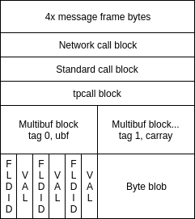

Enduro/X Machine Independent network cluster protocol
=====================================================
:doctype: book

== About manual

This document describes the network data encoding protocol used for connecting
Enduro/X instances between machines of different architectures. Enduro/X is
operating with the same type of machine architectures and operating systems, then
native format network protocol is recommended to be used, which is sending direct
C structures between the Enduro/X instances.

How ever in cases when Enduro/X application is run on different type of machines
and cluster link is needed between those instances, machine independent format
shall be used. This format can activated by setting flag "-f" in *tpbridge(8)*
command line arguments for both end points.

Protocol is constructed as Tag Length Value (TLV) encoded data, where Tag and Length
has fixed length. Data part may be encoded as Binary Coded Decimal (BCD), ASCII
or Binary data.

Protocol by it self operates in asynchronous fashion and is loosely coupled with
the call semantics (i.e. when the reply is required, etc), it is out of the scope
for protocol it self. How ever this document will present basic work flows for
the messaging sessions.

Currently over the one server:port end-point only one TCP/IP socket is handled.
Each end-point represents a node in Enduro/X cluster with configured / unique 
within cluster Node ID.

== Abbreviations

.Used Abbreviations
|=========================================================
|Abbreviation |Description
|BCD | Binary Coded Decimal. The way how numbers are encoded. The decimal number
is encoded in hex representation. It is more compact than ASCII, but still
manageable to debug in hex dump.
|TLV | Tag Length value
|=========================================================

== Physical network connection

To establish physical network connection with Enduro/X application server, asynchronous
socket shall be used. Each message sent in socket is prefixed with 4 bytes length
indicator. The length bytes does not include length bytes by it self, but it indicates
the number of bytes that are part of the incoming message. After the length indicator
bytes the data bytes follows. Length bytes are order in network order, which is 
big-endian. Thus if message length with out length bytes are in decimal is 15888, 
then following frame bytes shall be sent: 0x00, 0x00, 0x10, 0x3e.

For keep-a-live, zero length messages are supported. Thus Enduro/X bridge periodically
may be configured to emit the zero length messages. If configured so, bridge will
wait corresponding idle messages too. If not received in configured time, the
connection is restarted.

== Message TLV Encoding rules

Messages are encoded with:

- Two byte TAG which identifies simple data type or complex data structure. Bytes
are encoded in network order big-endian.

- 4 byte (unsigned) data length identifier, also encoded in network order of
big-endian. Length specifies number of is used by data.

- Data block which corresponds to the TAG meaning.

Data alignment is not used for encoded message. When parsing a protocol, any 
un-recognized tags shall be ignored.

== General structures data layout

All the exchanged messages within protocol as is based on the structures principles.
Where we can look on structure like a complex data type. Each structure may
consist of basic data types or complex data types. Which makes messages a
hierarchical tree of the structures. Where leaf structures always consists of
basic data types. This document uses term "block", "complex data typed block", "message blocks" 
and "structures" with the same meaning.

Basically network messages consists of the message blocks. These message blocks
then are constructed basic data types and complex data type blocks.

Typical message layout would be:

== Basic Data type encoding

This section lists data types used in message protocol and their specifics.

[[numbers-anchor]]
=== Numbers

Numbers in messages are encoded as binary coded decimals. Binary coded decimal
means that value is encoded in ASCII representation of hex value. Thus when analyzing
the message dumps in hex format, the encoded values can be clearly seen. For example
if value of unsigned integer 43219 needs to be transmitted over the protocol,
the number will be encoded in 3 bytes as follows: 0x04,0x32,0x19.

If the number is signed, then last in left-to-right order char encodes the sign. 
"0" is positive or  zero, "1" is negative number. For example having Signed Integer 
type value -717711, it will be encoded as 0x07, 0x17, 0x71, 0x11.

*Floats* and *doubles* are encoded with fixed implied resolution. For Floats 5 digits
decimal fraction is encoded in BCD value. For Doubles 6 digits are encoded in
trailer. So for example, having Double value 654.999812, would be encoded in
BCD as following bytes:x65, x49, x99, 0x81, 0x20 (note as number
is not negative, it is terminated with 0).

Enduro/X may run on 32bit (LP32) and 64bit (LP64) platforms. Some data types differ between
these platforms, particularity *long* and *unsigned long* as they corresponds
to platform bits. Internally Enduro/X uses values which in case
of longs does not go over 32bit values, but user application for example may
send in UBF field 64bit long value. In that particular case C function sscanf()
may overflow if maximum 64bit value is sent to 32bit value. End result is value
which was returned by sscanf().

=== Strings and blobs (Carray)

Strings and blobs are encoded as generic byte array. String data may not contain
0x00 byte, where carray can. The length is encoded in TLV Length component.

[[time-anchor]]
=== Enduro/X time field

Enduro/X internally uses *NTIMER* data type which represents transportation
of number of seconds (20 digits) and number of nanoseconds (20 digits). Thus
Total length of the field is 40 digits, which in BCD is 20 bytes. The "time since"
is relate and exact start time source is specified with the particular field
use.

=== Legend of all data type presentation

For numeric types variable length fields length is specified logical digits. 
For signed numeric types this does not include sign digit. Numeric type length 
does not include zero prefix for BCD in case if odd number of digits are present 
in final BCD representation. 

Field length for strings, blobs (carrays) and sub-structures is specified in
number of bytes.

.List of basic data types
|=========================================================
|Type name |Description
|<Type>..X | Field length form 0 to X.
|<Type>X..Y |  Field length from X to Y.
|<Type>X | Fixed field length X.
|SHORT | Signed short field. 16bit value.
|LONG | Signed long field. 32bit or 64bit value.
|CHAR | One byte ASCII char. Shall not contain 0x00 terminator byte. In that
case field TLV length shall be 0.
|FLOAT | Floating point value. See <<numbers-anchor>> for encoding rules.
|DOUBLE | Double precision value. See <<numbers-anchor>> for encoding rules.
|STRING | String value. May contains all ASCII characters, except 0x00 byte.
|CARRAY | This is blob type, may contain any bytes.
|INT | Signed integer type, 32bit type.
|ULONG | Unsigned long. 32 or 64 bit value.
|UINT | 32bit usinged integer.
|NTIMER | Time field. seconds and nano-seconds. See <<time-anchor>>. Field is
fixed length of 40 digits.
|USHORT | 16bit unsigned value.
|=========================================================

=== Legend of constants

This section lists any constants used in the document.

.List of basic data types
|=========================================================
|Const name |Description
|PMSGMAX | This is constant number and represents maximum message length. For
Enduro/X it is configured in *NDRX_MSGSIZEMAX* env variable.
|=========================================================

== Complex data type blocks

This section list complex data type blocks which are later incorporated in the
message blocks.

=== Network call block
...

=== Standard call block
...

=== Multi-buffer block (array of) for XATMI call data transport (MBUF)

*Type code: MBUF*

*Complex type block code: MBUF*

As Enduro/X may send several buffers with one request, for reasons of call info
data, primary buffer and and primary buffer is UBF it might have embedded VIEW,
UBF objects or UBF might contain pointer to other buffers. Thus multiple XATMI
buffers are serialized.

Multi-buffer block is array of 0..N XATMI buffer typed blocks. Each Multi-buffer
block encodes MBUF tag. Which by it self holds the information about what type
of XATMI buffer it represents. And any additional flags, such as is this Multi-buffer
block a call info. Or is it Primary buffer, or a UBF pointer to buffer (i.e.
virtual pointer).

Layout of the block is following:

image:ex_netproto_multibuf.png[caption="Figure 2: ", title="Multi-buffer array"]

.Multi-buffer block
|=========================================================
|TLV TAG | Name | Format | Condition | Default value | Description
|0x132F | tag | UINT1..10 | Mand | N/A | This is Multi-buffer tag. Not to confuse with
TLV tag. This tag is used to identify the particular Multi-buffer. The tag
consists of first 26 bits of this 32bit unsigned-integer. If bit No *27.* is set
to *1*. This means that particular buffer is *tpsetcallinfo(3)* associated buffer
with primary buffer. The call info bit must be set only for tag *0*. If call
info bit is set, then call primary buffer is at tag *1*. If call info bit 27 is
not set, then primary buffer is at tag *0*. Any other tags are virtual pointer,
i.e. primary buffer in that case must be *UBF* typed and it must hold a *BFLD_PTR*
with references to these tags. Buffer type is by it self is encoded at bits 28..32.
Currently following buffer types are supported: *0* - *UBF* buffer, *2* - *TPINIT*
buffer, *3* - *NULL* buffer, *4* - *STRING* buffer, *5* - *CARRAY* buffer, *6* - 
*JSON* buffer, *7* - *VIEW* buffer.
|0x1343 | data | XATMIBUF0..PMSGMAX | Mand | N/A |This is actual XATMI buffer data. Encoded
according to data type specified at bits 28..32 in* 0x132F* tag value (mbuf tag field name).
|=========================================================

=== XATMI buffer (XATMIBUF)

*Abstract type code: XATMIBUF*

Enduro/X supports different data types which are the "body" of the XATMI IPC
calls. Data types are complex ones like UBF which is hash of arrays, VIEW data
which "managed" are C structures. And basic data types such as strings and blobs
(carray).

==== UBF data (array of)

UBF data is encoded as array of Compiled 32bit FLDID UBF field id and corresponding
value. UBF field may include another UBF buffer or it may include VIEW data.
Fields in the message must be presented in growing order of the field types and 
field IDs. Which basically makes that all UBF fields in protocol message must
be present in sorted by compiled filed id from smallest ID till the biggest ID.
If the order is not complied with, the message conversation fails and message
will be dropped.

Field id is generated by *mkfldhdr(8)* program.

.UBF Buffer type block
|=========================================================
|TLV TAG | Name | Format | Cond | Default value | Description
|0x10FF |bfldid |UINT1..9 |Mand |N/A |Compiled UBF field id (for *BFLD_SHORT* type).
|0x1113 |short |SHORT1..6 |C1 |N/A |Short value for bfldid (for *BFLD_LONG* type).
|0x111D |long |LONG1..20 |C1 |N/A |Long value for bfldid (for *BFLD_CHAR* type).
|0x1127 |char |CHAR |C 1|N/A |Char value for bfldid (for *BFLD_CHAR* type).
|0x1131 |float |FLOAT1..40 |C1 |N/A |Float value for bfldid (for *BFLD_FLOAT* type).
|0x113B |double |DOUBLE1..40 |C1 |N/A |Double precision value for bfldid (for *BFLD_DOUBLE* type).
|0x1145 |string |STRING0..PMSGMAX |C1 |N/A |String value for bfldid (for *BFLD_STRING* type).
|0x114F |carray |CARRAY0..PMSGMAX |C1 |N/A |Blob value for bfldid (for *BFLD_CARRAY* type).
|0x1152 |ptr |LONG1..20 |C1 |N/A  |Virtual pointer to MBUF tag (with out type 
bits and call info bits) (for *BFLD_PTR* type).
|0x1153 |ubf |XATMIBUF0..PMSGMAX |C1 |N/A |Embedded UBF (for *BFLD_UBF* type).
|0x1154 |view |XATMIBUF1..PMSGMAX |C1 |N/A |Embedded VIEW (for *BFLD_VIEW* type).
|=========================================================

C1 - Only one field is present from all with C1. Field must correspond the field 
type for which corresponds the encoded data type in 'bfldid' (i.e. bits 26..32).

UBF field id bits 26+ meaning:

.UBF Type numbers
|=========================================================
|Type name       | Type number
|BFLD_SHORT      |0
|BFLD_LONG       |1
|BFLD_CHAR       |2
|BFLD_FLOAT      |3
|BFLD_DOUBLE     |4
|BFLD_STRING     |5
|BFLD_CARRAY     |6
|BFLD_PTR        |9 
|BFLD_UBF        |10
|BFLD_VIEW       |11
|=========================================================

===== Example data block

Having UBF buffer as:

--------------------------------------------------------------------------------

T_LONG_3_FLD    0
T_LONG_3_FLD    0
T_LONG_3_FLD    0
T_LONG_3_FLD    889991
T_DOUBLE_FLD    3.141590
T_STRING_7_FLD  
T_STRING_7_FLD  
T_STRING_7_FLD  ANOTHER UB
T_STRING_9_FLD  
T_STRING_9_FLD  
T_STRING_9_FLD  
T_STRING_9_FLD  HELLO WORLD UB

--------------------------------------------------------------------------------

With field IDs defined as:

--------------------------------------------------------------------------------
*base 1000
T_LONG_3_FLD            33      long    - 1 Long test field 3
T_DOUBLE_FLD            51      double  - 1 Double test field 1
T_STRING_7_FLD          67      string  - 1 String test field 7
T_STRING_9_FLD          69      string  - 1 String test field 9
--------------------------------------------------------------------------------

The serialized data would look like:

--------------------------------------------------------------------------------
  0370                                               10                 .
  0380  ff 00 00 00 05 01 67 77 32 29 11 45 00 00 00 00  ......gw2).E....
  0390  10 ff 00 00 00 05 01 67 77 32 29 11 45 00 00 00  .......gw2).E...
  03a0  00 10 ff 00 00 00 05 01 67 77 32 29 11 45 00 00  ........gw2).E..
  03b0  00 00 10 ff 00 00 00 05 01 67 77 32 29 11 45 00  .........gw2).E.
  03c0  00 00 0e 48 45 4c 4c 4f 20 57 4f 52 4c 44 20 55  ...HELLO WORLD U
  03d0  42
--------------------------------------------------------------------------------

==== View Data (array of)

VIEW buffer data is encoded as array. But with exception VIEW meta data
must follow first and only once. 

.VIEW metadata type block
|=========================================================
|TLV TAG | Name | Format | Cond | Default value | Description
|0x13B1 |vname |STRING0..33 |Mand |N/A | View name. Might be empty string
For "emtpy" occurrences when embedded in UBF sub-field
|0x13BB |vflags |UINT1 |Opt |0 |View flags. Not used and must be sent as *0*
|=========================================================

Following blocks repeats with each of the view field occurrence:

.VIEW Buffer type block (array of)
|=========================================================
|TLV TAG | Name | Format | Cond | Default value | Description
|0x134D |cname |STRING1..256    |N/A |View field name
|0x1360 |short |SHORT1..6       |N/A |Short value
|0x1361 |long |LONG1..20        |N/A |Long value
|0x1362 |char |CHAR             |N/A |ASCII char byte
|0x1363 |float |FLOAT1..40      |N/A |Float value
|0x1364 |double |DOUBLE1..40    |N/A |Double
|0x1365 |string |STRING0..PMSGMAX   |N/A |String value
|0x1366 |carray |CARRAY0..PMSGMAX   |N/A |Carray (blob) value
|0x1367 |int |INT1..12              |N/A |Integer value
|=========================================================

===== Example data block

Having VIEW C struct as:

--------------------------------------------------------------------------------

struct UBTESTVIEW2 {
        short   tshort1;
        long    tlong1;
        char    tchar1;
        float   tfloat1;
        double  tdouble1;
        char    tstring1[15];
        char    tcarray1[10];
};

--------------------------------------------------------------------------------

The VIEW is serialized in the following XATMI buffer block:

--------------------------------------------------------------------------------

  0330  13 b1 00 00 00 0b 55 42 54 45 53 54 56 49 45 57  ......UBTESTVIEW
  0340  32 13 bb 00 00 00 01 00 13 4d 00 00 00 07 74 73  2........M....ts
  0350  68 6f 72 74 31 13 60 00 00 00 02 10 00 13 4d 00  hort1.`.......M.
  0360  00 00 06 74 6c 6f 6e 67 31 13 61 00 00 00 02 20  ...tlong1.a.... 
  0370  00 13 4d 00 00 00 06 74 63 68 61 72 31 13 62 00  ..M....tchar1.b.
  0380  00 00 01 47 13 4d 00 00 00 07 74 66 6c 6f 61 74  ...G.M....tfloat
  0390  31 13 63 00 00 00 05 04 00 00 00 00 13 4d 00 00  1.c..........M..
  03a0  00 08 74 64 6f 75 62 6c 65 31 13 64 00 00 00 05  ..tdouble1.d....
  03b0  50 00 00 00 00 13 4d 00 00 00 08 74 73 74 72 69  P.....M....tstri
  03c0  6e 67 31 13 65 00 00 00 03 36 58 58 13 4d 00 00  ng1.e....6XX.M..
  03d0  00 08 74 63 61 72 72 61 79 31 13 66 00 00 00 0a  ..tcarray1.f....
  03e0  37 58 58 00 00 00 00 00 00 10                    7XX.............

--------------------------------------------------------------------------------

==== Other data buffers

Other buffers basically includes generic byte array of data.

===== String data

String buffer data normally does not include 0x00 terminating EOS symbol. Empty
strings or string termination is identified by TLV length component.

===== JSON data

JSON buffer data is processed in the same way as string buffer data.

===== NULL buffer

For null buffers TLV length component always contains 0. And no data follows.

== Message blocks

Message blocks are actual business messages which are used for exchanging the
information between cluster instances. Message blocks uses basic and complex data
type blocks previously described to construct the messages.

=== General work flow

Establishing connection - time adjustment

=== Time adjustment exchange block
...

=== Service table refresh block
...

=== Generic command call block
...

=== TP Call / TP Reply block
...

=== TP Notify / TP Broadcast block
...

////////////////////////////////////////////////////////////////
The index is normally left completely empty, it's contents being
generated automatically by the DocBook toolchain.
////////////////////////////////////////////////////////////////
