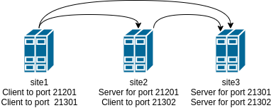

Migrating from Oracle Tuxedo to Enduro/X
========================================
:doctype: book

== About the guide

This document describes different aspects which needs to be accounted for
when performing migration from Oracle Tuxedo to Enduro/X middleware.
The document describes common elements which Enduro/X covers from Tuxedo
functionality, how functionality and configuration differs.

Lastly document describes standard approach for performing configuration
migration for Tuxedo UBB Config to Enduro/X based configuration

Document shall be read by anybody which is involved into migration project
from Oracle Tuxedo to Enduro/X middleware.

== Overview

Both systems are build on X/Open *XATMI*, *XA*, *TX* standards. Each of the systems
implement extensions over theses APIs. For example Tuxedo have *FML* key-value
structure format handling API. Enduro/X counterpart for this functionality is
*UBF* buffers which even provide emulation for *FML* via *fml.h* and *fml32.h*
headers shipped with Enduro/X.

Enduro/X tends to implement most majority of the C APIs which are typically used in
Tuxedo application. To verify your application compatibility with Enduro/X, 
perform manual scan over your code base and check each Tuxedo API in Enduro/X
documentation.

Enduro/X uses different configuration file formats than Tuxedo, however majority
of the configuration concepts are the same.

Enduro/X provides tool *tmloadcf(8)* which allows to automatically convert Tuxedo
UBB configuration.

== API compatibility aspects

Mostly all XATMI/FML calls are supported by Enduro/X with the same logic and
parameters. This section lists some (but not all) known differences:

- *tpgetctxt(3)* Enduro/X version after the call puts current thread outside
of any context association.

== Migration process
...

=== Automatic configuration migration
...

=== Manual configuration migration

Even if configuration is being migrated by automatic approach, it is worth to
read this section. This allows get solid understand of the Enduro/X concepts by using
existing Tuxedo knowledge.

If looking on Tuxedo UBBCONFIG and Enduro/X ndrxconfig.xml/app.ini, then following
similarities projects:

.UBBConfig - Enduro/X section mapping
[width="80%", options="header"]
|=========================================================
|Ubb config section|Enduro/X ndrxconfig.xml|Enduro/X app.ini|Comments
|*RESOURCES|-|[@global] section|Approximate mapping
|*MACHINES|-|[@global], [@debug] path related infos|Approximate mapping
|*GROUPS|-|[@global/<CCTAG>] - global settings per tag, [@queue/<CCTAG>] - persistent
queue configuration per tag.|Approximate mapping
|*NETWORK|Bridge is established as *tpbridge(8)* XATMI server 
processes in <servers> section|-|Approximate mapping
|*SERVERS|<endurox>/<servers> tag |-|-
|*SERVERS server|<endurox>/<servers>/<server name="server"> tag |-|-
|*SERVERS DEFAULT:|<endurox>/<defaults> tag |-|-
|*SERVICES|<endurox>/<services>|-|Service settings are global per instance, i.e.
cannot be configured per cctag.
|*SERVICES service|<endurox>/<services>/<service svcnm="service">|-|-
|*SERVICES DEFAULT:|<endurox>/<services>/<defaults>|-|-
|*ROUTING|<endurox>/<routing>|-|Defaults not supported at this section.
|*ROUTING route|<endurox>/<routing>/<route routing="route">|-|-
|=========================================================

.Tuxedo - Enduro/X key binaries mapping
[width="80%", options="header"]
|=========================================================
|Tuxedo binary|Enduro/X equivalent|Comments
|tmadmin|xadmin|There are set of common commands, like psc, start, etc.
|BBL, DBBL|ndrxd|
|tlisten|tpbridge|Enduro/X binary is booted as a normal XATMI binary, i.e.
it is not required to start it before application boots
|TMSYSEVT,TMUSEREV|tpevsrv|Also Enduro/X event server is booted as a normal
XATMI binary.
|TMS|tmsrv|Enduro/X version of *tmsrv* supports loading XA switches via shared
libraries. So it is possible to configure *tmsrv* instances for different resources
without need to perform *buildtms(8)*. Enduro/X supports Tuxedo mode too, when
transaction manager is built for particular resource manager.
|=========================================================

=== Creating base configuration for Enduro/X

It is recommended to create base configuration for Enduro/X which is then amended
to match the migrated system setup.

In order to create a working instance of the Enduro/X application, you may use
following command:

--------------------------------------------------------------------------------

$ xadmin provision

--------------------------------------------------------------------------------

This will create base system layout, including directories and configuration files
such as:

- ndrxconfig.xml
- app.ini
- settest1 (environment loader)

For further document we assume that system code "test1" is used.

=== UBB Configuration vs Enduro/X ini/xml format

*Tuxedo* use UBB configuration file, which is kind of extended ini file. This
describes majority of information used for Tuxedo application instance.

Other hand *Enduro/X* uses two separate files for the configuration. One is
XML configuration file (*ndrxconfig.xml(5)* typically) which describes the XATMI
server and client processes, services and DDR info. The other file is standard 
*ini* file (typically *app.ini*) which include per binary configuration.

Typically Enduro/X application are configure with third environment file
which loads the env variables in the shell session. File name typically
starts with *set*.

=== Converting "*RESOURCES" section

Enduro/X resources shall be configured according to the *ex_env(5)* manpage. This
section lists elements with the same or close meaning. Enduro/X setting
is written in *app.ini* in *[@global]* or *[@global/<CCTAG>]* section.

.Tuxedo - Enduro/X resources mapping
[options="header"]
|=========================================================
|Tuxedo setting|Enduro/X equivalent|Comments
|IPCKEY|NDRX_IPCKEY|System wide IPC (shm, msg, sem) identifier offset.
This is hex value. For Enduro/X *0x* or *0X* prefix must not be present in value.
| MAXSERVERS | NDRX_SRVMAX | Max number of servers instance can handle
| MAXSERVICES | NDRX_SVCMAX | Max number of services instance can handle.
For Enduro/X bigger number (something like x2) is recommended, so that linear
hashing/service lookup would work faster.
|SCANUNIT, BLOCKTIME | NDRX_TOUT | In Enduro/X timeouts are configured in single
variable, set in seconds. Can be converted as NDRX_TOUT=(Tux SCANUNIT) * (Tux BLOCKTIME).
|SCANUNIT| NDRX_SCANUNIT| In case if using *SystemV* release (AIX pre 7.3, Solaris),
Enduro/X binaries internally by additional thread scan for timeouts in the local
process. The scanning is done by *NDRX_SCANUNIT* setting (in milliseconds), which
by default is *1000*. For Linux, FreeBSD, MacOS release these is not applicable.
|MAXRTDATA|NDRX_RTCRTMAX|Number of bytes available for routing criterion storage.
|=========================================================

=== Converting "*MACHINES" section

In Enduro/X normally it each configuration set applies only to one machine/instance.
So in Enduro/X there is no such direct equivalent to this section. However some
useful information is encoded in Tuxedo counter part.

When converting multi-server UBBConfig file, it is needed to split all the resources
in UBBConfig by *LMID*. For following UBB sections that could be done via *GROUP*
setting.

If converting single machine (or multiple machines and working in different directories
for each set of the files), then output files may be named as

. set<lmid_lowercase>

. ndrxconfig.xml

. app.ini

In case if converting multiple machines in the same configuration directories,
following configuration naming strategy shall be used:

. set<lmid_lowercase>

. ndrxconfig.<lmid_lowercase>.xml

. app.<lmid_lowercase>.ini

Following information from "*MACHINES" section projects to Enduro/X:

*settest1*:

--------------------------------------------------------------------------------

#/bin/bash
#
# @(#) Load this script in environment before Enduro/X start
#

# update to correspond actual Enduro/X installation path
export NDRX_HOME=/usr
export NDRX_APPHOME=<Common part between APPDIR and TUXCONFIG, if not common part, just use APPDIR >
export NDRX_CCONFIG=<Directory name of TUXCONFIG>/app.ini
export CDPATH=$CDPATH:.:${NDRX_APPHOME}
export PATH=$PATH:<APPDIR>

--------------------------------------------------------------------------------

Additionally dirname of UBB *ULOGPFX* can be used as [@global]/NDRX_ULOG. Where
later *NDRX_ULOG* by it self means a directory where ULOG files are written by
mask 'ULOG.YYYYMMDD' and process debug logging is written.

Data from UBB *ENVFILE* may be copied to *app.ini* [@global] section.

The above is just recommended way how to setup runtime environment. Other
approaches may be used too, according to *ex_env(5)* and 
*getting_started_tutorial(guides)(Getting Started Tutorial)*.

So if having Tuxedo configuration like:

--------------------------------------------------------------------------------

*MACHINES
"SOME-MACHINE"  LMID=TEST1
        TUXDIR="/some/folder/tuxedo12"
        APPDIR="/user90/bin"
        TUXCONFIG="/user90/conf/tuxconfig"
        ULOGPFX="/user90/log/ULOG"
        TLOGDEVICE="/user90/conf/TLOG"
        ENVFILE="./env_common.txt" 

--------------------------------------------------------------------------------

That would be projected as following Enduro/X *set* file (*settest1*):

--------------------------------------------------------------------------------

# update to correspond actual Enduro/X installation path
export NDRX_HOME=/usr
export NDRX_APPHOME=/user90
export NDRX_CCONFIG=${NDRX_APPHOME}/conf/app.ini
export CDPATH=$CDPATH:.:${NDRX_APPHOME}
export PATH=$PATH:${NDRX_APPHOME}/bin

--------------------------------------------------------------------------------

Additionally *app.ini* would get:

--------------------------------------------------------------------------------

[@global]
...
NDRX_ULOG=${NDRX_APPHOME}/log

# + any data from ENVFILE, directly copied here, as syntax basically is the same

--------------------------------------------------------------------------------

=== Converting "*NETWORK" section

In Tuxedo, on each server *tlisten* binary shall be started which listens for
any other node to connect. In Tuxedo this binary must be started before Tuxedo
is booted.

In Enduro/X each cluster link (between this and other node) must be defined in 
*<servers />* as a normal ATMI server. The XATMI server process is *tpbridge(8)*. 
In one of the nodes listening/binding address/port must be set, 
in other node socket client mode shall be configured to connect to first node.

For example, if node *1* shall be connected to nodes *2* and *3*, then on node *1*, two 
*tpbridge* process shall be configured, to establish links to nodes *2* and *3*.

In Enduro/X cluster each server is identified with unique number in range for
1..32, set in *NDRX_NODEID* parameter. This similar to Tuxedo's *LMID*, but
value is strictly limited to numbers only. (during conversion *LMID* keyword
by *ubb2ex(8)* is used for resource prefixing for each instance).

==== Establishing links between nodes, by example

This assumes the scenario, when cluster is established by three nodes with LMIDs:
SITE1, SITE2, SITE3. Each node establishes link with each.

*UBB configuration:*

This assumes that *tlisten* is started correctly prior Tuxedo boot.

--------------------------------------------------------------------------------

*NETWORK
SITE1 NADDR="//localhost:999"
NLSADDR="server1"

SITE2 NADDR="//127.0.0.1:999"
NLSADDR="server2"

# hex format, first variant
SITE3 NADDR="\\X00020AFF7F000001"
NLSADDR="server3"

--------------------------------------------------------------------------------

*Enduro/X Configuration:*

Enduro/X to have equivalent network setup, following connections needs to be defined:

*Note:* Port numbers shall be assigned manually for each of the links. *ubb2ex* uses
following strategy: each listening socket derives the port number as:
21000+NDRX_NODEID(currnet) * O_flag(default 100) + NDRX_NODEID(remote), e.g.
If node *3* is listening for node 1 incoming connection, then for particular
connection listening port would be: 21000+3*100+1 = 21301. This algorithm ensures
that all migrated instances can be booted on localhost. If all booting on localhost
is not needed, then when converting with *ubb2ex*, the flag -O may be set to *0*,
which would prepare listening socket ports as number of 21000 + NDRX_NODEID(remote).

*ndrxconfig.site1.xml*

--------------------------------------------------------------------------------
<endurox>
...
    <servers>
...
        <!-- bi-directional link to site2, we are socket clients -->
        <server name="tpbridge">
            <min>1</min>
            <max>1</max>
            <srvid>6</srvid>
            <sysopt>-e ${NDRX_ULOG}/tpbridge.${NDRX_SVSRVID}.log</sysopt>
            <appopt>-n2 -r -i 127.0.0.1 -p 21201 -tA -z30</appopt>
        </server>
        <!-- bi-directional link to site3, we are socket clients -->
        <server name="tpbridge">
            <min>1</min>
            <max>1</max>
            <srvid>7</srvid>
            <sysopt>-e ${NDRX_ULOG}/tpbridge.${NDRX_SVSRVID}.log</sysopt>
            <appopt>-n3 -r -i 127.0.0.1 -p 21301 -tA -z30</appopt>
        </server>

--------------------------------------------------------------------------------

*NOTE:* Each connection either server or client fined by *tpbridge(8)*, contains 
other node id in parameter *-n*.

*NOTE:* These examples assumes that machine architectures are the same, if different
architecture machines are being clusters (e.g. x86, PowerPC), then between these
machines protocol mode must be enabled by *-f* cli flag for *tpbridge*.

*ndrxconfig.site2.xml*

--------------------------------------------------------------------------------
<endurox>
...
    <servers>
...
        <!-- This is listening socket, for node1 to connect to us -->
        <server name="tpbridge">
            <min>1</min>
            <max>1</max>
            <srvid>5</srvid>
            <sysopt>-e ${NDRX_ULOG}/tpbridge.${NDRX_SVSRVID}.log</sysopt>
            <appopt>-n1 -r -i 0.0.0.0 -p 21201 -tP -z30</appopt>
        </server>
        <!-- This is client socket connecting to node 3 -->
        <server name="tpbridge">
            <min>1</min>
            <max>1</max>
            <srvid>7</srvid>
            <sysopt>-e ${NDRX_ULOG}/tpbridge.${NDRX_SVSRVID}.log</sysopt>
            <appopt>-n3 -r -i 127.0.0.1 -p 21302 -tA -z30</appopt>
        </server>

--------------------------------------------------------------------------------

*ndrxconfig.site3.xml*

--------------------------------------------------------------------------------
<endurox>
...
    <servers>
...
        <!-- incoming socket for node1 -->
        <server name="tpbridge">
            <min>1</min>
            <max>1</max>
            <srvid>5</srvid>
            <sysopt>-e ${NDRX_ULOG}/tpbridge.${NDRX_SVSRVID}.log</sysopt>
            <appopt>-n1 -r -i 0.0.0.0 -p 21301 -tP -z30</appopt>
        </server>
        <!-- incoming socket for node2 -->
        <server name="tpbridge">
            <min>1</min>
            <max>1</max>
            <srvid>6</srvid>
            <sysopt>-e ${NDRX_ULOG}/tpbridge.${NDRX_SVSRVID}.log</sysopt>
            <appopt>-n2 -r -i 0.0.0.0 -p 21302 -tP -z30</appopt>
        </server>

--------------------------------------------------------------------------------

=== Converting "*GROUPS" section

Tuxedo groups can be replaced with Enduro/X CCTAGs. CCTAG basically instructs
processes that during XATMI initialization, library shall read specific parts
from the *app.ini* configuration file. Mainly data encoded in Tuxedo "\*GROUPS"
entry matches to the *[@global/<CCTAG>]* subsection.

Few more differences:

. Tuxedo's *SRVID* shall be unique within group, in Enduro/X *<srvid />* setting
must be unique at instance level.

. In Enduro/X CCTAGs cannot be used to encode two or more instances in one configuration
file. If several cluster instances must be configured, then configuration must
be split and separate set/ini/xml files shall be produced according to *LMID* setting.

. Enduro/X CCTAGs may not be used to put processes in backup groups. The migration
tool when processing such groups, only first identifier value for *LMID* is used.

. In case if XA processing and DDR is not performed by the group, the CCTAG
is not needed to be assigned to the process. The process may be removed from
CCTAG (if default was used) the empty *<cctag />* setting may be used under the *<server />* tag.

.Tuxedo - Enduro/X group mapping
[options="header"]
|=========================================================
|Tuxedo setting|Enduro/X equivalent|Comments
|GRPNO| app.ini: [@global/<CCTAG>]/NDRX_XA_RES_ID=__GRPNO__| Shall be set only if group fines XA resource

|TMSNAME| ndrxconfig.xml: <endurox>/<servers>/<server name="'TMSNAME'">| If 'TMSNAME' name is *TMS*, then *tmsrv*
name shall be used.  For null XA switch groups *app.ini* 
*[@global/CCTAG]/NDRX_XA_DRIVERLIB*  shall be set to *libndrxxanulls.so*.

For /Q queues, *[@global/CCTAG]/NDRX_XA_DRIVERLIB* shall be set to *libndrxxaqdisks.so*
and *[@global/CCTAG]/NDRX_XA_RMLIB* shall be set to *libndrxxaqdisk.so*.

For all other XA groups, *[@global/CCTAG]/NDRX_XA_DRIVERLIB* shall be set to 
*libndrxxatmsx.so* to use built-in xa switch.

|TMSCOUNT|ndrxconfig.xml: 
<endurox>/<servers>/<server name="_TMSNAME_">/<min>__TMSCOUNT__</min> 
and
<endurox>/<servers>/<server name="_TMSNAME_">/<max>__TMSCOUNT__</max>|
Configures TMSRV number of copies. In Enduro/X
this is configured in the same way as all other XA servers.

|OPENINFO| app.ini: [@global/<CCTAG>]/NDRX_XA_OPEN_STR=__OPENINFO__|When converting from
Tuxedo, the XA vendors interface name with colon (:) must be stripped from the value
copied to app.ini.

|CLOSEINFO|app.ini: [@global/<CCTAG>]/NDRX_XA_CLOSE_STR=__CLOSEINFO__|When converting from
Tuxedo, the XA vendors interface name with colon (:) must be stripped from the value
copied to app.ini. If not info is required by XA switch vendor, value "-" shall be used.

|ENVFILE|ndrxconfig.xml: <endurox>/<servers>/<server>/<env>__ENVFILE__</env> |

|Group participates in DDR|app.ini: [@global/<CCTAG>]/NDRX_RTGRP=_GROUP_NAME_|
*Note:* The routing group name with any service name in the grouting group, must not
exceed *29* symbols. 
|=========================================================

==== Converting XA NULL group, participates in DDR, by example

*UBB configuration:*

--------------------------------------------------------------------------------

*GROUPS
...

DDR1 GRPNO=5 OPENINFO="NONE" TMSNAME="TMS TMSCOUNT=3

*SERVERS
...

"atmi.sv90_3"   SRVID=400 MIN=2 MAX=4 SRVGRP=DDR1 CLOPT="-s TESTSV_DDR:TESTSV -- "
"atmi.sv90_4"   SRVID=420 MIN=2 MAX=4 SRVGRP=DDR1 CLOPT="-A -- "

--------------------------------------------------------------------------------

*Enduro/X configuration:*

*app.ini:*

--------------------------------------------------------------------------------

[@global/DDR1]
NDRX_XA_RES_ID=5
NDRX_XA_OPEN_STR=-
NDRX_XA_CLOSE_STR=-
NDRX_XA_DRIVERLIB=libndrxxanulls.so
NDRX_XA_RMLIB=-
NDRX_XA_LAZY_INIT=0
NDRX_XA_FLAGS=FDATASYNC;DSYNC
NDRX_RTGRP=DDR1

--------------------------------------------------------------------------------

*NB:* To protect transactions against OS crash or HW crash, *FDATASYNC*, *DSYNC*
flags shall be enabled. The downside of this is, that performance would be
reduced significantly.

*ndrxconfig.xml:*

--------------------------------------------------------------------------------
<endurox>
...
    <servers>
        ...
        <!-- tmsrv or custom tms only once defined per first CCTAG/XA configuration usage -->
        <server name="tmsrv">
            <cctag>DDR1</cctag>
            <min>3</min>
            <max>3</max>
            <srvid>10</srvid>
            <sysopt>-e ${NDRX_ULOG}/tmsrv.${NDRX_SVSRVID}.log -r</sysopt>
            <appopt>-t1 -l ${NDRX_APPHOME}/tmlogs/rm5</appopt>
        </server>
        <server name="atmi.sv90_3">
            <cctag>DDR1</cctag>
            <min>2</min>
            <max>4</max>
            <srvid>400</srvid>
            <sysopt>-N -e ${NDRX_ULOG}/atmi.sv90_3.${NDRX_SVSRVID}.log -s TESTSV_DDR:TESTSV</sysopt>
        </server>
        <server name="atmi.sv90_4">
            <cctag>DDR1</cctag>
            <min>2</min>
            <max>4</max>
            <srvid>420</srvid>
            <sysopt>-e ${NDRX_ULOG}/atmi.sv90_4.${NDRX_SVSRVID}.log</sysopt>
        </server>
...
--------------------------------------------------------------------------------

When XA related CCTAG is firstly used, the *tmsrv(5)* instance shall be defined.
For each *tmsrv* or custom built *TMS* instance used, machine readable log directory shall be defined.
In this example directory *$\{NDRX_APPHOME\}/tmlogs/rm5* is used.

==== Converting /Q XA group, by example

In case if converting Tuxedo /Q queue groups additional mapping is used, i.e.
Tuxedo's *TMQUEUE* and *TMQFORWARD* processes are merged under single *tmqueue(8)* instance.
Also all persistent queue setup is performed in *app.ini*, no need for any special script
execution, as it is in case of Tuxedo.

*UBB configuration:*

--------------------------------------------------------------------------------

*GROUPS
...
QGRP1   LMID=TEST1 GRPNO=8 TMSNAME=TMS_QM TMSCOUNT=2 OPENINFO="TUXEDO/QM:/user90/conf/QUEUEA:QSPA"

*SERVERS
...

DEFAULT:        SRVGRP=QGRP1
                RESTART=N
                REPLYQ=N
                CLOPT="-A"

TMQUEUE         SRVID=40 CLOPT="-A -s QSPA:TMQUEUE -- "

...

DEFAULT:                        SRVGRP=QGRP1

TMQFORWARD      SRVID=1100 MIN=1 MAX=1 CLOPT="-A -- -i 2 -qQGRP1_1"
TMQFORWARD      SRVID=1120 MIN=1 MAX=1 CLOPT="-A -- -i 2 -qQGRP1_2 -t60"
TMQFORWARD      SRVID=1130 MIN=2 MAX=3 CLOPT="-A -- -i 2 -qQGRP1_3 "

--------------------------------------------------------------------------------

*Enduro/X configuration:*

*app.ini:*

--------------------------------------------------------------------------------

[@global/QGRP1]
NDRX_XA_RES_ID=8
NDRX_XA_OPEN_STR=datadir="${NDRX_APPHOME}/qdata/QSPA",qspace="QSPA"
NDRX_XA_CLOSE_STR=${NDRX_XA_OPEN_STR}
NDRX_XA_DRIVERLIB=libndrxxaqdisks.so
NDRX_XA_RMLIB=libndrxxaqdisk.so
NDRX_XA_LAZY_INIT=0
NDRX_XA_FLAGS=FDATASYNC;DSYNC

# Queue definitions:
[@queue/QGRP1]
# Review as necessary, see q.conf man page for details
@=svcnm=@,autoq=n,tries=3,waitinit=0,waitretry=30,waitretrymax=90,memonly=n,mode=fifo,workers=1
QGRP1_1=autoq=y
QGRP1_3=autoq=y,workers=2
QGRP1_2=autoq=y,txtout=60

--------------------------------------------------------------------------------

Section *[@queue]* shall be reviewed according to *q.conf(5)* instructions. Non automatic
queues Enduro/X will instantiate automatically. The queue defaults are encoded in line
starting with *@*. If *svcnm* is set to *@*, this means that automatic queue will send
message to service whose name matches the queue name.

Enduro/X persistent queues stores data in the directory on the disk, the path corresponds
to the *datadir* setting in *NDRX_XA_OPEN_STR*. The queue space name is encoded in *qspace*
parameter.

*ndrxconfig.xml:*

--------------------------------------------------------------------------------
<endurox>
...
    <defaults>
        <cctag>QGRP1</cctag>
        <respawn>N</respawn>
    </defaults>
    <servers>
        <server name="tmsrv">
            <min>2</min>
            <max>2</max>
            <srvid>8</srvid>
            <sysopt>-e ${NDRX_ULOG}/tmsrv.${NDRX_SVSRVID}.log -r</sysopt>
            <appopt>-t1 -l ${NDRX_APPHOME}/tmlogs/rm8</appopt>
        </server>
        <server name="tmqueue">
            <min>1</min>
            <max>1</max>
            <srvid>40</srvid>
            <sysopt>-e ${NDRX_ULOG}/tmqueue.${NDRX_SVSRVID}.log -r</sysopt>
            <appopt>-s1 -p10 -f10</appopt>
        </server>
    </servers>
...

--------------------------------------------------------------------------------

*NOTE*: No instance of *TMQFORWARD* is required. All forward handling is done
by *tmqueue(8)* process. Number of forward threads are set in *-f* parameter,
to avoid any waiting on senders, the number of forward threads shall match
the total number of workers (*workers* setting in queue definition) 
configured for automatic queues.

==== Converting normal XA group, by example

*UBB configuration:*

--------------------------------------------------------------------------------

*GROUPS
...

ORAGRP2 LMID=TEST1
                GRPNO=6
                TMSNAME=TMS_ORA_2
                TMSCOUNT=2
                OPENINFO="Oracle_XA:ORACLE_XA+DB=ROCKY+SqlNet=SID1+ACC=P/username/password+SesTM=10+LogDir=/user90/xalog+Threads=true"
                CLOSEINFO="Oracle_XA:CLOSE_STR"

*SERVERS
...
orabin2       SRVID=2000 SRVGRP=ORAGRP2

--------------------------------------------------------------------------------

*Enduro/X configuration:*

*app.ini:*

--------------------------------------------------------------------------------

[@global/ORAGRP2]
NDRX_XA_RES_ID=6
NDRX_XA_OPEN_STR=ORACLE_XA+DB=ROCKY+SqlNet=SID1+ACC=P/username/password+SesTM=10+LogDir=/user90/xalog+Threads=true
NDRX_XA_CLOSE_STR=CLOSE_STR
# use built in switch resolver
NDRX_XA_DRIVERLIB=libndrxxatmsx.so
NDRX_XA_RMLIB=-
NDRX_XA_LAZY_INIT=1
NDRX_XA_FLAGS=RECON:*:3:100;FDATASYNC;DSYNC

--------------------------------------------------------------------------------

*ndrxconfig.xml:*

--------------------------------------------------------------------------------

<endurox>
...
    <servers>
...
        <server name="TMS_ORA_2">
            <cctag>ORAGRP2</cctag>
            <min>2</min>
            <max>2</max>
            <srvid>19</srvid>
            <sysopt>-e ${NDRX_ULOG}/TMS_ORA_2.${NDRX_SVSRVID}.log -r</sysopt>
            <appopt>-t1 -l ${NDRX_APPHOME}/tmlogs/rm6</appopt>
        </server>
        <server name="orabin2">
            <cctag>ORAGRP2</cctag>
            <srvid>2100</srvid>
            <sysopt>-e ${NDRX_ULOG}/orabin2.${NDRX_SVSRVID}.log</sysopt>
        </server>
...
--------------------------------------------------------------------------------

In this case transaction manager used is custom built from *buildtms(8)* output.
This is one of the modes that may be used. The other option Enduro/X offer is to
use generic *tmsrv* process and use one of the our XA switch loader shared
libraries:

. *libndrxxaecpg(8)*: PostgreSQL PQ/ECPG XA switch emulator and loader. 
Use *NDRX_XA_DRIVERLIB=libndrxxaecpg.so*, *NDRX_XA_RMLIB=-*. 

. *libndrxxapq(8)*:  PostgreSQL PQ XA switch emulator and loader. 
Use *NDRX_XA_DRIVERLIB=libndrxxapq.so*, *NDRX_XA_RMLIB=-*. 

. *libndrxxaoras(8)*: Oracle DB XA Switch loader. Use *NDRX_XA_DRIVERLIB=libndrxxaoras.so* 
for static registration switch (*xaosw*), use *NDRX_XA_DRIVERLIB=libndrxxaorad.so* 
for dynamic registration switch (*xaoswd*). Set *NDRX_XA_RMLIB* to the DB specific shared 
library which provides XA switches, e.g. *NDRX_XA_RMLIB=libclntsh.so*, by assuming that correct 
shared library path is configured in the environment. *NOTE:* As *tmsrv* in Enduro/X is multi-threaded, 
remember to set *+Threads=true* in *NDRX_XA_OPEN_STR* for Oracle DB connections.

. *libndrxxawsmqs(8)*: IBM WebSphere MQ XA Driver loader. Use *NDRX_XA_DRIVERLIB=libndrxxawsmqs.so* 
for static registration switch (*MQRMIXASwitch*), use *NDRX_XA_DRIVERLIB=libndrxxawsmqd.so* 
for dynamic registration switch (*MQRMIXASwitchDynamic*). Set *NDRX_XA_RMLIB* to the MQ specific shared 
library which provides XA switches, e.g. *NDRX_XA_RMLIB=libmqmxa64_r.so*, by assuming that correct 
shared library path is configured in the environment. The multi-threaded library version shall
be used.

. *libndrxxadb2s*: IBM DB2 XA Switch loader. Use *NDRX_XA_DRIVERLIB=libndrxxadb2s.so* 
for static registration switch (*db2xacicst_std*), use *NDRX_XA_DRIVERLIB=libndrxxadb2d.so* 
for dynamic registration switch (*db2xacic_std*). Set *NDRX_XA_RMLIB* to the DB specific shared 
library which provides XA switches, e.g. *NDRX_XA_RMLIB=libdb2.so*, by assuming that correct 
shared library path is configured in the environment.

The above *TMS_ORA_2* usage example may be configured as:

*app.ini:*

--------------------------------------------------------------------------------

[@global/ORAGRP2]
NDRX_XA_RES_ID=6
NDRX_XA_OPEN_STR=ORACLE_XA+DB=ROCKY+SqlNet=SID1+ACC=P/username/password+SesTM=10+LogDir=/user90/xalog+Threads=true
NDRX_XA_CLOSE_STR=CLOSE_STR
NDRX_XA_DRIVERLIB=libndrxxaoras.so
NDRX_XA_RMLIB=libclntsh.so
NDRX_XA_LAZY_INIT=1
NDRX_XA_FLAGS=RECON:*:3:100;FDATASYNC;DSYNC

--------------------------------------------------------------------------------

*ndrxconfig.xml:*

--------------------------------------------------------------------------------

<endurox>
...
    <servers>
...
        <server name="tmsrv">
            <cctag>ORAGRP2</cctag>
            <min>2</min>
            <max>2</max>
            <srvid>19</srvid>
            <sysopt>-e ${NDRX_ULOG}/tmsrv.${NDRX_SVSRVID}.log -r</sysopt>
            <appopt>-t1 -l ${NDRX_APPHOME}/tmlogs/rm6</appopt>
        </server>
        <server name="orabin2">
            <cctag>ORAGRP2</cctag>
            <srvid>2100</srvid>
            <sysopt>-e ${NDRX_ULOG}/orabin2.${NDRX_SVSRVID}.log</sysopt>
        </server>
...

--------------------------------------------------------------------------------

==== Additional notes for XA processing

When XA groups are used and for some reason there is chance that *tmsrv* logs
are lost (for example, FSYNC flags were not used), additional process *tmrecoversv(5)*
is recommended to be started at the and of application boot, which would collect the orphaned
prepared transactions from all resource managers, and would perform the rollback of them.
The rollbacks are not performed by resource managers automatically, due to fact that
prepared transactions (from two phase commit protocol) are stuck in the database waiting
for further commands from transaction managers.

*Enduro/X configuration:*

--------------------------------------------------------------------------------

<endurox>
..
    <defaults>
        <cctag/>
        <min>1</min>
        <max>1</max>
    </defaults>
    <servers>
        <server name="tmrecoversv">
            <srvid>6</srvid>
            <sysopt>-e ${NDRX_ULOG}/tmrecoversv.${NDRX_SVSRVID}.log -r</sysopt>
            <appopt>-p -s10</appopt>
        </server>

--------------------------------------------------------------------------------

=== Converting "*SERVERS" section

Servers and their defaults migrates to Enduro/X XML configuration relatively straight
forward. Following section summarizes the server entry mapping

.Tuxedo - Enduro/X Server mapping
[options="header"]
|=========================================================
|Tuxedo setting|Enduro/X equivalent in <server>|Comments
|SRVGRP|<cctag>|
|SRVID|<srvid>|In Enduro/X must be unique across the instance configuration.
|CLOPT|<sysopt>, <appopt>|In Enduro/X clopt may split by the -- in two parts
server options goes to *<sysopt>* and all other options to *<appopt>*,
but it is possible to leave all to the *<sysopt>*.
|MIN|<min>|
|MAX|<max>|
|ENVFILE|<env>|
|CONV|N/A|For conversational servers at Enduro/X no special settings required.
Conversational servers builds and configures in the same way as normal XATMI
servers.
|RQADDR|<rqaddr>|Used only for *SystemV* polling mode (Solaris, pre AIX 7.3).
For all other modes, it is ignored.
|RESTART|<respawn>|For Enduro/X default is *Y*.
|MINDISPATCHTHREADS|<mindispatchthreads>|For Enduro/X minimum and default is 1.
|MAXDISPATCHTHREADS|<maxdispatchthreads>|For Enduro/X minimum and default is 1.
|THREADSTACKSIZE|NDRX_THREADSTACKSIZE in app.ini, or configured in <envs> tag as:

<envs><env name="NDRX_THREADSTACKSIZE">__THREADSTACKSIZE__/__1024__</env></envs>
| Enduro/X value is in KB, thus UBB config value needs to be divided by 1024.

|=========================================================

==== Converting server command line options

The Server command line options mostly matches between Tuxedo and Enduro/X XATMI
servers, with few exceptions. Following table lists the details:

.Tuxedo - Enduro/X Server CLOPT mapping
[options="header"]
|=========================================================
|Tuxedo CLOPT|Enduro/X <sysopt>|Comments
|-A|-N|Cross mapping applies. In Enduro/X all servers are advertised by default.
In case if in Tuxedo configuration *-A* is used, no flag must be set in Enduro/X.
In case if *-A* is not used in Tuxedo configuration, in Enduro/X *-N* shall be used,
to suppress advertise all.
|-s|-s|Enduro/X does not support @filename syntax (advertise from file). All other
work modes of the *-s* matches.
|-e|-e|If not configured, Enduro/X logs all *stderr* to the parent process *stderr*, 
effectively *ndrxd(8)*.
|-o|-e|Enduro/X redirect all *stdout* the the same *stderr* output. If not configured,
output will be sent to parent process, *stderr*, effectively *ndrxd(8)*.
|-r|-r|Enduro/X ignores this flag.
|=========================================================

Also the *<sysopt>* and *<appopt>* tags are not available for default value by
*<endurox>/<defaults>*.

==== Converting server, by example

*UBB Configuration:*

--------------------------------------------------------------------------------

DEFAULT:        SRVGRP=DFLTGRP
                MIN=1
                MAX=5
                REPLYQ=Y
                MAXGEN=10
                RESTART=N
                CLOPT="-A"

"atmi.sv90"     SRVID=100 MIN=2 MAX=4 CLOPT="-A --"
"atmi.sv90_2"   SRVID=200 MIN=1 MAX=4 CLOPT="-A -e /tmp/err.out -- -c \"HELLO \\\"WORLD\""

DEFAULT:                        MAX=11

orabin3            SRVID=2200 SRVGRP=ORAGRP3 THREADSTACKSIZE=6500000

--------------------------------------------------------------------------------

*ndrxconfig.xml:*

--------------------------------------------------------------------------------

<endurox>
...
    <defaults>
        <cctag>DFLTGRP</cctag>
        <min>1</min>
        <max>5</max>
        <respawn>N</respawn>
    </defaults>
    <servers>
        <server name="atmi.sv90">
            <min>2</min>
            <max>4</max>
            <srvid>100</srvid>
            <sysopt />
        </server>
        <server name="atmi.sv90_2">
            <min>1</min>
            <max>4</max>
            <srvid>200</srvid>
            <sysopt>-e /tmp/err.out</sysopt>
            <appopt>-c "HELLO \"WORLD"</appopt>
        </server>
...
    <defaults>
        <max>11</max>
    </defaults>
    <servers>
        <server name="orabin3">
            <cctag>ORAGRP3</cctag>
            <srvid>2200</srvid>
            <envs><env name="NDRX_THREADSTACKSIZE">6347</env></envs>
        </server>
...

--------------------------------------------------------------------------------

==== Converting event server

In case if application uses eventing (i.e. *tppost(3)* or *tpsubscribe(3)*, etc.)
event server needs to be configured. Existing *TMSYSEVT* or *TMUSREVT* servers shall be replaced
with single instance of *tpevsrv(8)*.

==== Converting TMSYSEVT, TMUSREVT, by example

*UBB configuration:*

--------------------------------------------------------------------------------

*SERVERS
TMUSREVT SRVGRP=ADMINGRP SRVID=10 CLOPT="-A -- -f /user90/conf/TMUSREVT"
TMSYSEVT SRVGRP=ADMINGRP SRVID=11 CLOPT="-A -- -f /user90/conf/TMSYSEVT"

--------------------------------------------------------------------------------

*ndrxconfig.xml:*

Enduro/X event server does not use control file, so when converting *-f* flag for
these servers may be ignored. For performance reasons it is recommended to set
thread dispatch threads to larger number than default *1*.

--------------------------------------------------------------------------------

<endurox>
...
    <servers>
    ...       
        <server name="tpevsrv">
            <min>1</min>
            <max>1</max>
            <srvid>10</srvid>
            <mindispatchthreads>5</mindispatchthreads>
            <maxdispatchthreads>5</maxdispatchthreads>
            <sysopt>-e ${NDRX_ULOG}/tpevsrv.${NDRX_SVSRVID}.log -r</sysopt>
        </server>

--------------------------------------------------------------------------------

For any server, if no special requirement is needed, *-e* shall be configured
and normally expected to be put to *NDRX_ULOG* directory with file name reflecting
the binary name and it's server id.

==== Adding admin server (for MIB interface)

In order to enable admin interface API via *.TMIB* service, *tpadmsv(8)* shall be
configured:

--------------------------------------------------------------------------------

<endurox>
...
    <servers>
    ...               
        <server name="tpadmsv">
            <min>2</min>
            <max>2</max>
            <srvid>3</srvid>
            <sysopt>-e ${NDRX_ULOG}/tpadmsv.${NDRX_SVSRVID}.log -r</sysopt>
        </server>

--------------------------------------------------------------------------------

It is optional and only and only used by *xadmin mibget* command or *.TMIB* service calls.

==== Debug logging configuration per binary

Enduro/X allow to configure debug log levels per binary. If no debug is configured, Enduro/X writes
logs for the processes at highest debug level (*5*), meaning that for normal use debug configuration
shall be configured.

Enduro/X logging is split across following topics:

. *ubf* - this is UBF/FML library logging. Normally shall be disabled (set to level *0*).

. *ndrx* - this is XATMI internals logging, normally logging may be leaved at level *2* (error) or *3* (warning).

. *tp* - user logs, wrote by *TP_LOG()* and related macros. Also applies to *tplog(3)* XATMI call. This log
level does not affect *ULOG* output.

Debug is configured according to *ndrxdebug.conf(5)* description. Sample section would look like:

*app.ini:*

--------------------------------------------------------------------------------

[@debug]
#* - goes for all binaries not listed bellow
*= ndrx=3 ubf=1 tp=3 threaded=l file=${NDRX_ULOG}/endurox.log
xadmin=file=${NDRX_ULOG}/xadmin.log
ndrxd=file=${NDRX_ULOG}/ndrxd.log
cconfsrv=file=${NDRX_ULOG}/cconfsrv.${NDRX_SVSRVID}.log
atmi.sv90=file=${NDRX_ULOG}/atmi.sv90.${NDRX_SVSRVID}.log

# this logs to stderr, except, if *-e* for server is set, then all logging
# is redirected to that particular file.
atmi.sv90_2= file=

--------------------------------------------------------------------------------

Debug settings are matched by the binary name. If binary is not found in the section, default * applies.
Logging applies to all XATMI related processes, clients and servers, and stand-alone binaries which
are just using UBF library, for example.

==== External connectivity replacements

Enduro/X does not have *WebLogic Tuxedo Connector* or *Jolt* libraries
for Java. But Enduro/X provides Web Services interface module *endurox-connect*,
particularly *restincl(8)* from which XATMI services can be exposed as JSONS 
web services. With this Enduro/X services may be called from any language which supports web
services. Web services API provides includes capability for managing global transactions
and associating the calls with the global transactions (this applies only for *restin* incoming
service layer).

If your software uses any of these following Tuxedo binaries: *WSL/WSH*, *JSL/JSH*, *WSH*, *GWWS*
then consider to use *endurox-connect* package. If using *ubb2ex(8)* tool, when it sees any
of these binaries, it omits them and provides sample *restincl(8)* configuration, for accepting
incoming web service calls.

Sample configuration:

*app.ini:*

--------------------------------------------------------------------------------

TODO:

--------------------------------------------------------------------------------

*ndrxconfig.xml:* 

--------------------------------------------------------------------------------

TODO:

--------------------------------------------------------------------------------

=== Converting "*SERVICES" section

TODO:

=== Converting "*ROUTING" section

TODO:

=== Service dispatching

By default in Tuxedo, if *RQADDR* setting is not configured, each server have
it's own request queue, where then in round-robin or similar fashion requests
from ATMI clients are dispatched. If *RQADDR* is configured, then 
services may work in Multiple Servers, Single Queue (*MSSQ*) model. However,
here requirement is that these servers listening one queue have all the same
services.

In Enduro/X when working in Linux (and FreeBSD), by default all 
services operate in *MSSQ* mode. Basically in Enduro/X each service 
is queue were several executables perform epoll() + EPOLLEXCLUSIVE 
listing on messages. Result is that different servers may have
different sets of services (including shared set of services) and on these shared
services effectively *MSSQ* mode will work out-of-the-box.

On IBM AIX and Oracle Solaris *<rqaddr />* principle may be used in the same way
as Tuxedo does. For MacOS *<rqaddr />* is not available and request dispatching
is done in round-robin fashion only.

=== Clustering

In Enduro/X applications each instance works as "master" node, forming
a peer to peer cluster. This means that each cluster node needs to be started
separately in opposite to Tuxedo, where cluster application is started from
master node, and secondary nodes are started by the master.

Enduro/X cluster works in similar fashion as Tuxedo Gateway, except that
*tpforward(3)* and all other APIs work in the same mode as Tuxedo's multi-machine
configuration (i.e. MODEL=MP).

=== Transaction management

While both platforms provide distributed transaction processing APIs and both
perform according to X/Open XA protocol, internally architecture for both products
are different. Key aspects are mentioned here:

- Log format

- Transaction managers

- Recovery

== Tuxedo connectivity and bindings

- *endurox-java* package serves as direct counterpart of the *Oracle Tuxedo Java*. Some
of the APIs are different, but majority conforms to the *TJATMI*. Enduro/X implementation
is based on JNI binding code. Each java instance is started as separate binary.

////////////////////////////////////////////////////////////////
The index is normally left completely empty, it's contents being
generated automatically by the DocBook toolchain.
////////////////////////////////////////////////////////////////
