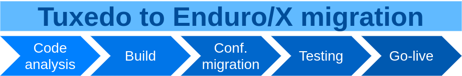

Migrating from Oracle Tuxedo to Enduro/X
========================================
:doctype: book

== About the guide

This document describes different aspects which needs to be accounted for
when performing migration from Oracle Tuxedo to Enduro/X middleware.
The document describes common elements which Enduro/X covers from Tuxedo
functionality, how functionality and configuration differs.

Lastly document describes standard approach for performing configuration
migration for Tuxedo UBB Config to Enduro/X based configuration

Document shall be read by anybody which is involved into migration project
from Oracle Tuxedo to Enduro/X middleware.

== Overview

Both systems are build on X/Open *XATMI*, *XA*, *TX* standards. Each of the systems
implement extensions over theses APIs. For example Tuxedo have *FML* key-value
structure format handling API. Enduro/X counterpart for this functionality is
*UBF* buffers which even provide emulation for *FML* via *fml.h* and *fml32.h*
headers shipped with Enduro/X.

Enduro/X tends to implement most majority of the C APIs which are typically used in
Tuxedo application. To verify your application compatibility with Enduro/X, 
perform manual scan over your code base and check each Tuxedo API in Enduro/X
documentation.

Enduro/X uses different configuration file formats than Tuxedo, however majority
of the configuration concepts are the same.

Enduro/X provides tool *ubb2ex(8)* which allows to automatically convert Tuxedo
UBB configuration to Enduro/X configuration files.

== API compatibility aspects

Mostly all XATMI/FML calls are supported by Enduro/X with the same logic and
parameters. This section lists some (but not all) known differences:

- *tpgetctxt(3)* Enduro/X version after the call puts current thread outside
of any context association.

- When using *tpnotify(3)* or *tpbroadcast(3)* in multi-machine mode, to
allow remote nodes to process the notifications, *tpbrdcstsv(8)* process
shall be started on the remote nodes. 

- In case if duplicate field IDs are used for UBF/FML, default logic
of *mkfldhdr(8)* would generate error. In case if for some reason duplicate
field IDs are OK, flag *ubf_dupfidok* shall be set in *NDRX_APIFLAGS* (see *ex_env(5)*).
Note that for runtime this flag is not required i.e. only needed for build time.

- *Bnext(3)* / Fnext() / Fnext32() Enduro/X version keeps the iteration state
within thread local storage, however Tuxedo stores the state in the FML buffer
(or uses some other mapped association of the iteration states of multiple buffers).
This means that if iterating multiple buffers at the same time by the same thread,
Enduro/X version will corrupt the iteration state for previous buffer iterations.
However Enduro/X offers *Bnext2(3)* API call which allow to store the iteration
state in reentrant way.

=== Tuxedo API bindings

- *endurox-java* package serves as direct counterpart of the *Oracle Tuxedo Java*. Some
of the APIs are different, but majority conforms to the *TJATMI*. Enduro/X implementation
is based on JNI binding code. Each java instance is started as separate binary.

== Enduro/X installation process

Before starting the migration, necessary package shall be installed. The binary
versions can be downloaded from https://www.mavimax.com/downloads where installers
for desired platforms can be found. For example, if installing for 
Red-Hat Enterprise Linux 8, following procedure applies:

--------------------------------------------------------------------------------

$ wget https://www.endurox.org/attachments/download/1393/endurox-7.5.34-5.oracleserver8_0_GNU_epoll.x86_64.rpm
$ wget https://www.endurox.org/attachments/download/1089/endurox-connect-2.5.0-1.oracleserver8_0.x86_64.rpm

$ su - root

# rpm -i endurox-7.5.34-5.oracleserver8_0_GNU_epoll.x86_64.rpm
# rpm -i endurox-connect-2.5.0-1.oracleserver8_0.x86_64.rpm

--------------------------------------------------------------------------------

Once packages are installed, system limits must be configured 
see ex_adminman(guides)(Enduro/X Administration Manual, Setup System) section,
particularly:

. 2.2. Linux setup / Increase OS limits

. 2.2. Linux setup / Setting Posix queue limits

For other Operating systems, other chapters applies from the administration manual.

== Migration process

Migration from Oracle Tuxedo to Enduro/X typically is accomplished by following steps:

. *Code analysis:* User application source code analysis for API compatibility. This can be done by
manually checking each of the Tuxedo calls and their counterparts in the Enduro/X
documentation. 

. *Build:* The first step may be skipped, and migration may be started with the build, to
let the compiler to analyze the source code compatibility. Enduro/X has the 
same build tools as Tuxedo: *buildserver(8)*,
*buildclient(8)* and *buildtms(8)*. In case if some of the APIs are missing, 
developer needs to figure out how user code can be changed to avoid such API
use. Or the other option is to contact Mavimax SIA company for change request
to introduce such new API.

. *Configuration migration:* Migrate the configuration either by 
automatic tool *ubb2ex(8)* or convert configuration manually according to next chapters.

. *Testing:* Perform extensive system testing.

. *Go live*.

== Automatic configuration migration

Enduro/X ships with the configuration migration tool *ubb2ex(8)*. Tool accepts valid
Tuxedo UBBConfig text format file. It is able to process multi-machine configuration
and it produces following set of configuration files for each of the *LMID* found
in UBBconfig:

. set<lmid_lowercase> - environment source bash script

. ndrxconfig.<lmid_lowercase>.xml - *ndrxd(8)* and *cpmsrv(8)* configuration file.

. app.<lmid_lowercase>.ini - per binary configuration file.

==== Automatic configuration migration, by example

In the following example prefix directory -P ./test_dir is used. This basically
adds prefix to all paths found in the *ubb_config1*.

--------------------------------------------------------------------------------

$ ubb2ex ubb_config1 -P ./test_dir
UBB2EX Tool

Enduro/X 7.5.36, build Dec 17 2021 22:33:46, using epoll for LINUX (64 bits)

Enduro/X Middleware Platform for Distributed Transaction Processing
Copyright (C) 2009-2016 ATR Baltic Ltd.
Copyright (C) 2017-2021 Mavimax Ltd. All Rights Reserved.

This software is released under one of the following licenses:
AGPLv3 (with Java and Go exceptions) or Mavimax license for commercial use.

$ cd test_dir/user90/conf

$ ls -1

app.test1.ini
ndrxconfig.test1.xml
settest1

$ source settest1

$ xadmin start -y
Enduro/X 7.5.36, build Dec 17 2021 22:33:46, using epoll for LINUX (64 bits)

Enduro/X Middleware Platform for Distributed Transaction Processing
Copyright (C) 2009-2016 ATR Baltic Ltd.
Copyright (C) 2017-2021 Mavimax Ltd. All Rights Reserved.

This software is released under one of the following licenses:
AGPLv3 (with Java and Go exceptions) or Mavimax license for commercial use.

* Shared resources opened...
* Enduro/X back-end (ndrxd) is not running
* ndrxd PID (from PID file): 57479
* ndrxd idle instance started.
exec cconfsrv -k C4Lwt7G4 -i 1 -e /tmp/test_dir/user90/log/cconfsrv.1.log -r --  :
	process id=57481 ... Started.
exec cconfsrv -k C4Lwt7G4 -i 2 -e /tmp/test_dir/user90/log/cconfsrv.2.log -r --  :
	process id=57482 ... Started.
exec tpadmsv -k C4Lwt7G4 -i 3 -e /tmp/test_dir/user90/log/tpadmsv.3.log -r --  :
	process id=57483 ... Started.
exec tpadmsv -k C4Lwt7G4 -i 4 -e /tmp/test_dir/user90/log/tpadmsv.4.log -r --  :
	process id=57484 ... Started.
exec tpevsrv -k C4Lwt7G4 -i 5 -e /tmp/test_dir/user90/log/tpevsrv.5.log -r --  :
	process id=57485 ... Started.
exec tmsrv -k C4Lwt7G4 -i 8 -e /tmp/test_dir/user90/log/tmsrv.8.log -r -- -t1 -l /tmp/test_dir/user90/tmlogs/rm8 :
	process id=57491 ... Started.
exec tmsrv -k C4Lwt7G4 -i 9 -e /tmp/test_dir/user90/log/tmsrv.9.log -r -- -t1 -l /tmp/test_dir/user90/tmlogs/rm8 :
	process id=57503 ... Started.
exec tmqueue -k C4Lwt7G4 -i 40 -e /tmp/test_dir/user90/log/tmqueue.40.log -r -- -s1 -p10 -f10 :

...
--------------------------------------------------------------------------------

== Manual configuration migration

Even if configuration is being migrated by automatic approach, it is worth to
read this section. This allows get solid understand of the Enduro/X concepts by using
existing Tuxedo knowledge.

=== How to read this manual

The following section lists only similar Oracle Tuxedo items which
can be mapped to Enduro/X configuration files. Any Tuxedo configuration sections
or settings that are not mentioned in bellow sections, does not map directly to
Enduro/X or Enduro/X have different concepts or approach for the functionality.

=== High level configuration and binaries mappings

If looking on Tuxedo UBBCONFIG and Enduro/X ndrxconfig.xml/app.ini, then following
similarities can be found:

.UBBConfig - Enduro/X section mapping
[width="80%", options="header"]
|=========================================================
|Ubb config section|Enduro/X ndrxconfig.xml|Enduro/X app.ini|Comments
|*RESOURCES|-|[@global] section|Approximate mapping
|*MACHINES|-|[@global], [@debug] path related infos|Approximate mapping
|*GROUPS|-|[@global/<CCTAG>] - global settings per tag, [@queue/<CCTAG>] - persistent
queue configuration per tag.|Approximate mapping
|*NETWORK|Bridge is established as *tpbridge(8)* XATMI server 
processes in <servers> section|-|Approximate mapping
|*SERVERS|<endurox>/<servers> tag |-|-
|*SERVERS server|<endurox>/<servers>/<server name="server"> tag |-|-
|*SERVERS DEFAULT:|<endurox>/<defaults> tag |-|-
|*SERVICES|<endurox>/<services>|-|Service settings are global per instance, i.e.
cannot be configured per cctag.
|*SERVICES service|<endurox>/<services>/<service svcnm="service">|-|-
|*SERVICES DEFAULT:|<endurox>/<services>/<defaults>|-|-
|*ROUTING|<endurox>/<routing>|-|Defaults are not supported for this section.
|*ROUTING route|<endurox>/<routing>/<route routing="route">|-|-
|=========================================================

.Tuxedo - Enduro/X key binaries mapping
[width="80%", options="header"]
|=========================================================
|Tuxedo binary|Enduro/X equivalent|Comments
|tmadmin|xadmin|There are set of common commands, like psc, start, etc.
|BBL, DBBL|ndrxd|
|tlisten|tpbridge|Enduro/X binary is booted as a normal XATMI binary, i.e.
it is not required to start it before application boots
|TMSYSEVT,TMUSEREV|tpevsrv|Also Enduro/X event server is booted as a normal
XATMI binary.
|TMS|tmsrv|Enduro/X version of *tmsrv* supports loading XA switches via shared
libraries. So it is possible to configure *tmsrv* instances for different resources
without need to perform *buildtms(8)*. Enduro/X supports Tuxedo mode too, when
transaction manager is built for particular resource manager.
|=========================================================

=== Creating base configuration for Enduro/X

It is recommended to create base configuration for Enduro/X which is then amended
to match the migrated system setup.

In order to create a working instance of the Enduro/X application, you may use
following command:

--------------------------------------------------------------------------------

$ xadmin provision

--------------------------------------------------------------------------------

This will create base system layout, including directories and configuration files
such as:

- ndrxconfig.xml
- app.ini
- settest1 (environment loader)

For further document we assume that system code "test1" is used.

=== UBB Configuration vs Enduro/X ini/xml format

*Tuxedo* use UBB configuration file, which is kind of extended ini file. This
describes majority of information used for Tuxedo application instance.

On the other hand *Enduro/X* uses two separate files for the configuration. One is
XML configuration file (*ndrxconfig.xml(5)* typically) which describes the XATMI
server and client processes, services and DDR info. The other file is standard 
*ini* file (typically *app.ini*) which include per binary configuration.

Usually, Enduro/X applications are configured with third configuration file
which loads the env variables in the shell session. File name typically
starts with *set* prefix.

=== Converting "*RESOURCES" section

Enduro/X resources shall be configured according to the *ex_env(5)* manpage. ThisF
section lists elements with the same or close meaning. Enduro/X setting
is written in *app.ini* in *[@global]* or *[@global/<CCTAG>]* section.

.Tuxedo - Enduro/X RESOURCES mapping
[options="header"]
|=========================================================
|Tuxedo setting|Enduro/X equivalent|Comments
|IPCKEY|NDRX_IPCKEY|System wide IPC (shm, msg, sem) identifier offset.
This is hex value. For Enduro/X *0x* or *0X* prefix must not be present in value.
| MAXSERVERS | NDRX_SRVMAX | Max number of servers instance can handle
| MAXSERVICES | NDRX_SVCMAX | Max number of services instance can handle.
For Enduro/X bigger number (something like x2) is recommended, so that linear
hashing/service lookup would work faster.
|SCANUNIT, BLOCKTIME | NDRX_TOUT | In Enduro/X timeouts are configured in single
variable, set in seconds. Can be converted as NDRX_TOUT=(Tux SCANUNIT) * (Tux BLOCKTIME).
|SCANUNIT| NDRX_SCANUNIT| In case if using *SystemV* release (AIX pre 7.3, Solaris),
Enduro/X binaries internally by additional thread scan for timeouts in the local
process. The scanning is done by *NDRX_SCANUNIT* setting (in milliseconds), which
by default is *1000*. For Linux, FreeBSD, MacOS release this is not applicable.
|MAXRTDATA|NDRX_RTCRTMAX|Number of bytes available for routing criterion storage.
|=========================================================

=== Converting "*MACHINES" section

In Enduro/X normally it each configuration set applies only to one machine/instance.
So in Enduro/X there is no such direct equivalent to this section. However, some
useful information is encoded in Tuxedo counterpart.

When converting multi-server UBBConfig file, it is needed to split all the resources
in UBBConfig by *LMID*. For following UBB sections that could be done via *GROUP*
setting.

If converting single machine (or multiple machines and working in different directories
for each set of the files), then output files may be named as:

. set<lmid_lowercase>

. ndrxconfig.xml

. app.ini

In case if converting multiple machines in the same configuration directories,
following configuration naming strategy shall be used:

. set<lmid_lowercase>

. ndrxconfig.<lmid_lowercase>.xml

. app.<lmid_lowercase>.ini

Following information from "*MACHINES" section projects to Enduro/X:

*settest1*:

--------------------------------------------------------------------------------

#/bin/bash
#
# @(#) Load this script in environment before Enduro/X start
#

# update to correspond actual Enduro/X installation path
export NDRX_HOME=/usr
export NDRX_APPHOME=<Common part between APPDIR and TUXCONFIG, if no common part found, just use APPDIR >
export NDRX_CCONFIG=<Directory name of TUXCONFIG>/app.ini
export CDPATH=$CDPATH:.:${NDRX_APPHOME}
export PATH=$PATH:<APPDIR>

--------------------------------------------------------------------------------

Additionally dirname of UBB *ULOGPFX* can be used as *[@global]/NDRX_ULOG*. Where
later *NDRX_ULOG* by it self means a directory where ULOG files are written by
mask 'ULOG.YYYYMMDD' and process debug logging is written.

Data from UBB *ENVFILE* setting may be copied to *app.ini* [@global] section.

The above is just recommended way how to setup runtime environment. Other
approaches may be used too, according to *ex_env(5)* and 
*getting_started_tutorial(guides)(Getting Started Tutorial)*.

So if having Tuxedo configuration like:

--------------------------------------------------------------------------------

*MACHINES
"SOME-MACHINE"  LMID=TEST1
        TUXDIR="/some/folder/tuxedo12"
        APPDIR="/user90/bin"
        TUXCONFIG="/user90/conf/tuxconfig"
        ULOGPFX="/user90/log/ULOG"
        TLOGDEVICE="/user90/conf/TLOG"
        ENVFILE="./env_common.txt" 

--------------------------------------------------------------------------------

That would be projected as following Enduro/X *set* file (*settest1*):

--------------------------------------------------------------------------------

# update to correspond actual Enduro/X installation path
export NDRX_HOME=/usr
export NDRX_APPHOME=/user90
export NDRX_CCONFIG=${NDRX_APPHOME}/conf/app.ini
export CDPATH=$CDPATH:.:${NDRX_APPHOME}
export PATH=$PATH:${NDRX_APPHOME}/bin

--------------------------------------------------------------------------------

Additionally, *app.ini* would get:

--------------------------------------------------------------------------------

[@global]
...
NDRX_ULOG=${NDRX_APPHOME}/log

# + any data from ENVFILE, directly copied here, as syntax basically is the same

--------------------------------------------------------------------------------

=== Converting "*NETWORK" section

In Tuxedo, on each server *tlisten* binary shall be started which listens for
any other node to connect. In Tuxedo this binary must be started before Tuxedo
is booted.

In Enduro/X each cluster link (between this and other node) must be defined in 
*<servers>* section as a normal XATMI server. The XATMI server process name 
for link establishment between two nodes is *tpbridge(8)*.
On one of the nodes listening/binding address/port must be configured together
with passive mode, and on other node socket client mode shall be configured 
to connect to first node.

For example, if node *1* shall be connected to nodes *2* and *3*, then on node *1*, two 
*tpbridge* process shall be configured, to establish links to nodes *2* and *3*.

In Enduro/X cluster each server is identified with unique number in range for
1..32, set in *NDRX_NODEID* parameter. This similar to Tuxedo's *LMID*, but
value is strictly limited to numbers only. (Actually during automatic 
conversion by *ubb2ex(8)*, UBB keyword *LMID* is used for each instance, 
and tool assigns *NDRX_NODEID* just by counting from *1* upwards
for each of the machines).

==== Establishing links between nodes, by example

This assumes the scenario, when cluster is established by three nodes with LMIDs:
SITE1, SITE2, SITE3. Each node establishes link with each.

*UBB configuration:*

This assumes that *tlisten* is started correctly prior Tuxedo boot.

--------------------------------------------------------------------------------

*NETWORK
SITE1 NADDR="//localhost:999"
NLSADDR="server1"

SITE2 NADDR="//127.0.0.1:999"
NLSADDR="server2"

# hex format, first variant
SITE3 NADDR="\\X00020AFF7F000001"
NLSADDR="server3"

--------------------------------------------------------------------------------

*Enduro/X Configuration:*

Enduro/X to have equivalent network setup, following connections needs to be defined:

*Note:* Port numbers shall be assigned manually for each of the links. *ubb2ex* uses
following strategy: each listening socket derives the port number as:
21000+NDRX_NODEID(currnet) * O_flag(default 100) + NDRX_NODEID(remote), e.g.
If node *3* is listening for node 1 incoming connection, then for particular
connection listening port would be: 21000+3*100+1 = 21301. This algorithm ensures
that all migrated instances can be booted on localhost. If all booting on localhost
is not needed, then when converting with *ubb2ex*, the flag -O may be set to *0*,
which would prepare listening socket ports as number of 21000 + NDRX_NODEID(remote).

*ndrxconfig.site1.xml*

--------------------------------------------------------------------------------
<endurox>
...
    <servers>
...
        <!-- bi-directional link to site2, we are socket clients -->
        <server name="tpbridge">
            <min>1</min>
            <max>1</max>
            <srvid>6</srvid>
            <sysopt>-e ${NDRX_ULOG}/tpbridge.${NDRX_SVSRVID}.log</sysopt>
            <appopt>-n2 -r -i 127.0.0.1 -p 21201 -tA -z30</appopt>
        </server>
        <!-- bi-directional link to site3, we are socket clients -->
        <server name="tpbridge">
            <min>1</min>
            <max>1</max>
            <srvid>7</srvid>
            <sysopt>-e ${NDRX_ULOG}/tpbridge.${NDRX_SVSRVID}.log</sysopt>
            <appopt>-n3 -r -i 127.0.0.1 -p 21301 -tA -z30</appopt>
        </server>

--------------------------------------------------------------------------------

*NOTE:* Each connection either server or client fined by *tpbridge(8)*, contains 
other node id in parameter *-n*.

*NOTE:* These examples assumes that machine architectures are the same, if different
architecture machines are being clustered (e.g. x86, PowerPC), then between these
machines protocol mode must be enabled by *-f* cli flag for *tpbridge* on both ends.

*ndrxconfig.site2.xml*

--------------------------------------------------------------------------------
<endurox>
...
    <servers>
...
        <!-- This is listening socket, for node1 to connect to us -->
        <server name="tpbridge">
            <min>1</min>
            <max>1</max>
            <srvid>5</srvid>
            <sysopt>-e ${NDRX_ULOG}/tpbridge.${NDRX_SVSRVID}.log</sysopt>
            <appopt>-n1 -r -i 0.0.0.0 -p 21201 -tP -z30</appopt>
        </server>
        <!-- This is client socket connecting to node 3 -->
        <server name="tpbridge">
            <min>1</min>
            <max>1</max>
            <srvid>7</srvid>
            <sysopt>-e ${NDRX_ULOG}/tpbridge.${NDRX_SVSRVID}.log</sysopt>
            <appopt>-n3 -r -i 127.0.0.1 -p 21302 -tA -z30</appopt>
        </server>

--------------------------------------------------------------------------------

*ndrxconfig.site3.xml*

--------------------------------------------------------------------------------
<endurox>
...
    <servers>
...
        <!-- incoming socket for node1 -->
        <server name="tpbridge">
            <min>1</min>
            <max>1</max>
            <srvid>5</srvid>
            <sysopt>-e ${NDRX_ULOG}/tpbridge.${NDRX_SVSRVID}.log</sysopt>
            <appopt>-n1 -r -i 0.0.0.0 -p 21301 -tP -z30</appopt>
        </server>
        <!-- incoming socket for node2 -->
        <server name="tpbridge">
            <min>1</min>
            <max>1</max>
            <srvid>6</srvid>
            <sysopt>-e ${NDRX_ULOG}/tpbridge.${NDRX_SVSRVID}.log</sysopt>
            <appopt>-n2 -r -i 0.0.0.0 -p 21302 -tP -z30</appopt>
        </server>

--------------------------------------------------------------------------------

=== Converting "*GROUPS" section

Tuxedo groups can be replaced with Enduro/X CCTAGs. CCTAG basically instructs
processes that during XATMI initialization, library shall read specific parts
from the *app.ini* configuration file. Mainly data encoded in Tuxedo "\*GROUPS"
entry matches to the *[@global/<CCTAG>]* subsection.

Few more differences:

. Tuxedo's *SRVID* shall be unique within group, in Enduro/X *<srvid />* setting
must be unique at instance level.

. In Enduro/X CCTAGs cannot be used to encode two or more instances in one configuration
file. If several cluster instances must be configured, then configuration must
be split and separate set/ini/xml files according to *LMIDs* used in Tuxedo configuration.

. Enduro/X CCTAGs may not be used to put processes in backup groups. The migration
tool when processing such groups uses only first *LMID* value specified for the group.

. In case if XA processing and DDR is not performed by the group, the CCTAG
is not needed to be assigned to the process. The process may be removed from
CCTAG (if default was used) the empty *<cctag />* setting may be used under the *<server />* tag.

.Tuxedo - Enduro/X GROUPS mapping
[options="header"]
|=========================================================
|Tuxedo setting|Enduro/X equivalent|Comments
|GRPNO| app.ini: [@global/<CCTAG>]/NDRX_XA_RES_ID=__GRPNO__| Shall be set only if group fines XA resource

|TMSNAME| ndrxconfig.xml: <endurox>/<servers>/<server name="'TMSNAME'">| If 'TMSNAME' name is *TMS*, then *tmsrv*
name shall be used.  For null XA switch groups *app.ini* 
*[@global/CCTAG]/NDRX_XA_DRIVERLIB*  shall be set to *libndrxxanulls.so*.

For /Q queues, *[@global/CCTAG]/NDRX_XA_DRIVERLIB* shall be set to *libndrxxaqdisks.so*
and *[@global/CCTAG]/NDRX_XA_RMLIB* shall be set to *libndrxxaqdisk.so*.

For all other XA groups, *[@global/CCTAG]/NDRX_XA_DRIVERLIB* shall be set to 
*libndrxxatmsx.so* to use built-in xa switch.

|TMSCOUNT|ndrxconfig.xml: 
<endurox>/<servers>/<server name="_TMSNAME_">/<min>__TMSCOUNT__</min> 
and
<endurox>/<servers>/<server name="_TMSNAME_">/<max>__TMSCOUNT__</max>|
Configures TMSRV number of copies. In Enduro/X
this is configured in the same way as all other XA servers.

|OPENINFO| app.ini: [@global/<CCTAG>]/NDRX_XA_OPEN_STR=__OPENINFO__|When converting from
Tuxedo, the XA vendors interface name with colon (:) must be stripped from the value
copied to app.ini.

|CLOSEINFO|app.ini: [@global/<CCTAG>]/NDRX_XA_CLOSE_STR=__CLOSEINFO__|When converting from
Tuxedo, the XA vendors interface name with colon (:) must be stripped from the value
copied to app.ini. If not info is required by XA switch vendor, value "-" shall be used.

|ENVFILE|Copy the data from __ENVFILE__ file to the [@global/<CCTAG>] ini sub-section |As basically
[@globa] section loads the environment variables for the process, to match environment
setup for each of the groups, the contents from the __ENVFILE__ file may be
copied to the *app.ini*.

|Group participates in DDR|app.ini: [@global/<CCTAG>]/NDRX_RTGRP=_GROUP_NAME_|
*Note:* The routing group name with any service name in the grouting group, must not
exceed *29* symbols. 
|=========================================================

==== Converting XA NULL group, participates in DDR, by example

*UBB configuration:*

--------------------------------------------------------------------------------

*GROUPS
...

DDR1 GRPNO=5 OPENINFO="NONE" TMSNAME="TMS" TMSCOUNT=3

*SERVERS
...

"atmi.sv90_3"   SRVID=400 MIN=2 MAX=4 SRVGRP=DDR1 CLOPT="-s TESTSV_DDR:TESTSV -- "
"atmi.sv90_4"   SRVID=420 MIN=2 MAX=4 SRVGRP=DDR1 CLOPT="-A -- "

--------------------------------------------------------------------------------

*Enduro/X configuration:*

*app.ini:*

--------------------------------------------------------------------------------

[@global/DDR1]
NDRX_XA_RES_ID=5
NDRX_XA_OPEN_STR=-
NDRX_XA_CLOSE_STR=-
NDRX_XA_DRIVERLIB=libndrxxanulls.so
NDRX_XA_RMLIB=-
NDRX_XA_LAZY_INIT=0
#NDRX_XA_FLAGS=FDATASYNC;DSYNC
NDRX_RTGRP=DDR1

--------------------------------------------------------------------------------

*NB:* To protect transactions against OS crash or HW crash, *FDATASYNC*, *DSYNC*
flags shall be enabled. The downside of this is, that performance would be
reduced significantly.

*ndrxconfig.xml:*

--------------------------------------------------------------------------------
<endurox>
...
    <servers>
        ...
        <!-- tmsrv or custom tms only once defined per first CCTAG/XA configuration usage -->
        <server name="tmsrv">
            <cctag>DDR1</cctag>
            <min>3</min>
            <max>3</max>
            <srvid>10</srvid>
            <sysopt>-e ${NDRX_ULOG}/tmsrv.${NDRX_SVSRVID}.log -r</sysopt>
            <appopt>-t1 -l ${NDRX_APPHOME}/tmlogs/rm5</appopt>
        </server>
        <server name="atmi.sv90_3">
            <cctag>DDR1</cctag>
            <min>2</min>
            <max>4</max>
            <srvid>400</srvid>
            <sysopt>-N -e ${NDRX_ULOG}/atmi.sv90_3.${NDRX_SVSRVID}.log -s TESTSV_DDR:TESTSV</sysopt>
        </server>
        <server name="atmi.sv90_4">
            <cctag>DDR1</cctag>
            <min>2</min>
            <max>4</max>
            <srvid>420</srvid>
            <sysopt>-e ${NDRX_ULOG}/atmi.sv90_4.${NDRX_SVSRVID}.log</sysopt>
        </server>
...
--------------------------------------------------------------------------------

When XA related CCTAG is firstly used, the *tmsrv(5)* instance shall be defined.
For each *tmsrv* or custom built *TMS* instance used, machine readable log directory shall be defined.
In this example directory *$\{NDRX_APPHOME\}/tmlogs/rm5* is used.

==== Converting /Q XA group, by example

In case if converting Tuxedo /Q queue groups additional mapping is used, i.e.
Tuxedo's *TMQUEUE* and *TMQFORWARD* processes are merged under single *tmqueue(8)* instance.
Also all persistent queue setup is performed in *app.ini*, no need for any special script
execution, as it is in case of Tuxedo.

*UBB configuration:*

--------------------------------------------------------------------------------

*GROUPS
...
QGRP1   LMID=TEST1 GRPNO=8 TMSNAME=TMS_QM TMSCOUNT=2 OPENINFO="TUXEDO/QM:/user90/conf/QUEUEA:QSPA"

*SERVERS
...

DEFAULT:        SRVGRP=QGRP1
                RESTART=N
                REPLYQ=N
                CLOPT="-A"

TMQUEUE         SRVID=40 CLOPT="-A -s QSPA:TMQUEUE -- "

...

DEFAULT:                        SRVGRP=QGRP1

TMQFORWARD      SRVID=1100 MIN=1 MAX=1 CLOPT="-A -- -i 2 -qQGRP1_1"
TMQFORWARD      SRVID=1120 MIN=1 MAX=1 CLOPT="-A -- -i 2 -qQGRP1_2 -t60"
TMQFORWARD      SRVID=1130 MIN=2 MAX=3 CLOPT="-A -- -i 2 -qQGRP1_3 "

--------------------------------------------------------------------------------

*Enduro/X configuration:*

*app.ini:*

--------------------------------------------------------------------------------

[@global/QGRP1]
NDRX_XA_RES_ID=8
NDRX_XA_OPEN_STR=datadir="${NDRX_APPHOME}/qdata/QSPA",qspace="QSPA"
NDRX_XA_CLOSE_STR=${NDRX_XA_OPEN_STR}
NDRX_XA_DRIVERLIB=libndrxxaqdisks.so
NDRX_XA_RMLIB=libndrxxaqdisk.so
NDRX_XA_LAZY_INIT=0
NDRX_XA_FLAGS=FDATASYNC;DSYNC

# Queue definitions:
[@queue/QGRP1]
# Review as necessary, see q.conf man page for details
@=svcnm=@,autoq=n,tries=3,waitinit=0,waitretry=30,waitretrymax=90,memonly=n,mode=fifo,workers=1
QGRP1_1=autoq=y
QGRP1_3=autoq=y,workers=2
QGRP1_2=autoq=y,txtout=60

--------------------------------------------------------------------------------

Section *[@queue]* shall be reviewed according to *q.conf(5)* instructions. Non-automatic
queues Enduro/X will instantiate automatically. The queue defaults are encoded in line
starting with *@*. If *svcnm* is set to *@*, this means that automatic queue will send
message to service whose name matches the queue name.

Enduro/X persistent queues stores data in the directory on the disk, the path corresponds
to the *datadir* setting in *NDRX_XA_OPEN_STR*. The queue space name is encoded in *qspace*
parameter.

*ndrxconfig.xml:*

--------------------------------------------------------------------------------
<endurox>
...
    <defaults>
        <cctag>QGRP1</cctag>
        <respawn>N</respawn>
    </defaults>
    <servers>
        <server name="tmsrv">
            <min>2</min>
            <max>2</max>
            <srvid>8</srvid>
            <sysopt>-e ${NDRX_ULOG}/tmsrv.${NDRX_SVSRVID}.log -r</sysopt>
            <appopt>-t1 -l ${NDRX_APPHOME}/tmlogs/rm8</appopt>
        </server>
        <server name="tmqueue">
            <min>1</min>
            <max>1</max>
            <srvid>40</srvid>
            <sysopt>-e ${NDRX_ULOG}/tmqueue.${NDRX_SVSRVID}.log -r</sysopt>
            <appopt>-s1 -p10 -f10</appopt>
        </server>
    </servers>
...

--------------------------------------------------------------------------------

*NOTE*: No instance of *TMQFORWARD* is required. All forward handling is done
by *tmqueue(8)* process. Number of forward threads are set in *-f* parameter,
to avoid any waiting on senders, the number of forward threads shall match
the total number of workers (*workers* setting in queue definition) 
configured for automatic queues.

==== Converting normal XA group, by example

*UBB configuration:*

--------------------------------------------------------------------------------

*GROUPS
...

ORAGRP2 LMID=TEST1
                GRPNO=6
                TMSNAME=TMS_ORA_2
                TMSCOUNT=2
                OPENINFO="Oracle_XA:ORACLE_XA+DB=ROCKY+SqlNet=SID1+ACC=P/username/password+SesTM=10+LogDir=/user90/xalog+Threads=true"
                CLOSEINFO="Oracle_XA:CLOSE_STR"

*SERVERS
...
orabin2       SRVID=2000 SRVGRP=ORAGRP2

--------------------------------------------------------------------------------

*Enduro/X configuration:*

*app.ini:*

--------------------------------------------------------------------------------

[@global/ORAGRP2]
NDRX_XA_RES_ID=6
NDRX_XA_OPEN_STR=ORACLE_XA+DB=ROCKY+SqlNet=SID1+ACC=P/username/password+SesTM=10+LogDir=/user90/xalog+Threads=true
NDRX_XA_CLOSE_STR=CLOSE_STR
# use built in switch resolver
NDRX_XA_DRIVERLIB=libndrxxatmsx.so
NDRX_XA_RMLIB=-
NDRX_XA_LAZY_INIT=1
NDRX_XA_FLAGS=RECON:*:3:100;FDATASYNC;DSYNC

--------------------------------------------------------------------------------

*ndrxconfig.xml:*

--------------------------------------------------------------------------------

<endurox>
...
    <servers>
...
        <server name="TMS_ORA_2">
            <cctag>ORAGRP2</cctag>
            <min>2</min>
            <max>2</max>
            <srvid>19</srvid>
            <sysopt>-e ${NDRX_ULOG}/TMS_ORA_2.${NDRX_SVSRVID}.log -r</sysopt>
            <appopt>-t1 -l ${NDRX_APPHOME}/tmlogs/rm6</appopt>
        </server>
        <server name="orabin2">
            <cctag>ORAGRP2</cctag>
            <srvid>2100</srvid>
            <sysopt>-e ${NDRX_ULOG}/orabin2.${NDRX_SVSRVID}.log</sysopt>
        </server>
...
--------------------------------------------------------------------------------

In this case transaction manager used is custom built from *buildtms(8)* output.
This is one of the modes that may be used. The other option Enduro/X offer is to
use generic *tmsrv* process and use one of the our XA switch loader shared
libraries:

. *libndrxxaecpg(8)*: PostgreSQL PQ/ECPG XA switch emulator and loader. 
Use *NDRX_XA_DRIVERLIB=libndrxxaecpg.so*, *NDRX_XA_RMLIB=-*. 

. *libndrxxapq(8)*:  PostgreSQL PQ XA switch emulator and loader. 
Use *NDRX_XA_DRIVERLIB=libndrxxapq.so*, *NDRX_XA_RMLIB=-*. 

. *libndrxxaoras(8)*: Oracle DB XA Switch loader. Use *NDRX_XA_DRIVERLIB=libndrxxaoras.so* 
for static registration switch (*xaosw*), use *NDRX_XA_DRIVERLIB=libndrxxaorad.so* 
for dynamic registration switch (*xaoswd*). Set *NDRX_XA_RMLIB* to the DB specific shared 
library which provides XA switches, e.g. *NDRX_XA_RMLIB=libclntsh.so*, by assuming that correct 
shared library path is configured in the environment. *NOTE:* As *tmsrv* in Enduro/X is multi-threaded, 
remember to set *+Threads=true* in *NDRX_XA_OPEN_STR* for Oracle DB connections.

. *libndrxxawsmqs(8)*: IBM WebSphere MQ XA Driver loader. Use *NDRX_XA_DRIVERLIB=libndrxxawsmqs.so* 
for static registration switch (*MQRMIXASwitch*), use *NDRX_XA_DRIVERLIB=libndrxxawsmqd.so* 
for dynamic registration switch (*MQRMIXASwitchDynamic*). Set *NDRX_XA_RMLIB* to the MQ specific shared 
library which provides XA switches, e.g. *NDRX_XA_RMLIB=libmqmxa64_r.so*, by assuming that correct 
shared library path is configured in the environment. The multi-threaded library version shall
be used.

. *libndrxxadb2s*: IBM DB2 XA Switch loader. Use *NDRX_XA_DRIVERLIB=libndrxxadb2s.so* 
for static registration switch (*db2xacicst_std*), use *NDRX_XA_DRIVERLIB=libndrxxadb2d.so* 
for dynamic registration switch (*db2xacic_std*). Set *NDRX_XA_RMLIB* to the DB specific shared 
library which provides XA switches, e.g. *NDRX_XA_RMLIB=libdb2.so*, by assuming that correct 
shared library path is configured in the environment.

The above *TMS_ORA_2* usage example may be configured as:

*app.ini:*

--------------------------------------------------------------------------------

[@global/ORAGRP2]
NDRX_XA_RES_ID=6
NDRX_XA_OPEN_STR=ORACLE_XA+DB=ROCKY+SqlNet=SID1+ACC=P/username/password+SesTM=10+LogDir=/user90/xalog+Threads=true
NDRX_XA_CLOSE_STR=CLOSE_STR
NDRX_XA_DRIVERLIB=libndrxxaoras.so
NDRX_XA_RMLIB=libclntsh.so
NDRX_XA_LAZY_INIT=1
NDRX_XA_FLAGS=RECON:*:3:100;FDATASYNC;DSYNC

--------------------------------------------------------------------------------

*ndrxconfig.xml:*

--------------------------------------------------------------------------------

<endurox>
...
    <servers>
...
        <server name="tmsrv">
            <cctag>ORAGRP2</cctag>
            <min>2</min>
            <max>2</max>
            <srvid>19</srvid>
            <sysopt>-e ${NDRX_ULOG}/tmsrv.${NDRX_SVSRVID}.log -r</sysopt>
            <appopt>-t1 -l ${NDRX_APPHOME}/tmlogs/rm6</appopt>
        </server>
        <server name="orabin2">
            <cctag>ORAGRP2</cctag>
            <srvid>2100</srvid>
            <sysopt>-e ${NDRX_ULOG}/orabin2.${NDRX_SVSRVID}.log</sysopt>
        </server>
...

--------------------------------------------------------------------------------

==== Additional notes for XA processing

When XA groups are used and for some reason there is chance that *tmsrv* logs
are lost (for example, FSYNC flags were not used), additional process *tmrecoversv(5)*
is recommended to be started at the and of application boot, which would collect the orphaned
prepared transactions from all resource managers, and would perform the rollback of them.
The rollbacks are not performed by resource managers automatically, due to fact that
prepared transactions (from two phase commit protocol) are stuck in the database waiting
for further commands from transaction managers.

*Enduro/X configuration:*

--------------------------------------------------------------------------------

<endurox>
..
    <defaults>
        <cctag/>
        <min>1</min>
        <max>1</max>
    </defaults>
    <servers>
        <server name="tmrecoversv">
            <srvid>6</srvid>
            <sysopt>-e ${NDRX_ULOG}/tmrecoversv.${NDRX_SVSRVID}.log -r</sysopt>
            <appopt>-p -s10</appopt>
        </server>

--------------------------------------------------------------------------------

=== Converting "*SERVERS" section

Servers and their defaults migrates to Enduro/X XML configuration relatively straight
forward. Following section summarizes the server entry mapping

.Tuxedo - Enduro/X SERVERS mapping
[options="header"]
|=========================================================
|Tuxedo setting|Enduro/X equivalent in <server> or <defaults> tags|Comments
|SRVGRP|<cctag>|
|SRVID|<srvid>|In Enduro/X must be unique across the instance configuration.
|CLOPT|<sysopt>, <appopt>|In Enduro/X clopt may split by the -- in two parts
server options goes to *<sysopt>* and all other options to *<appopt>*,
but it is possible to leave all to the *<sysopt>*. Setting is not available for
<defaults>.
|MIN|<min>|
|MAX|<max>|
|ENVFILE|<env>|
|CONV|N/A|For conversational servers at Enduro/X no special settings required.
Conversational servers builds and configures in the same way as normal XATMI
servers.
|RQADDR|<rqaddr>|Used only for *SystemV* polling mode (Solaris, pre AIX 7.3).
For all other modes, it is ignored.
|RESTART|<respawn>|For Enduro/X default is *Y*.
|MINDISPATCHTHREADS|<mindispatchthreads>|For Enduro/X minimum and default is 1.
|MAXDISPATCHTHREADS|<maxdispatchthreads>|For Enduro/X minimum and default is 1.
|THREADSTACKSIZE|NDRX_THREADSTACKSIZE in app.ini, or configured in <envs> tag as:

<envs><env name="NDRX_THREADSTACKSIZE">__THREADSTACKSIZE__/__1024__</env></envs>
| Enduro/X value is in KB, thus UBB config value needs to be divided by 1024.

|=========================================================

==== Converting server command line options

The Server command line options mostly matches between Tuxedo and Enduro/X XATMI
servers, with few exceptions. Following table lists the details:

.Tuxedo - Enduro/X Server CLOPT mapping
[options="header"]
|=========================================================
|Tuxedo CLOPT|Enduro/X <sysopt>|Comments
|-A|-B|Cross mapping applies. In Enduro/X all servers are advertised by default.
In case if in Tuxedo configuration *-A* is used, no flag must be used for Enduro/X.
In case if *-A* is not used in Tuxedo configuration, in Enduro/X *-B* shall be used,
to suppress advertise of built-in services.
|-s|-S|Enduro/X does not support @filename syntax (advertise from file). All other
work modes matches. The lower case *-s* parameter in Enduro/X provides functionality
to alias services to other services instead of functions.
|-e|-e|If not configured, Enduro/X logs all *stderr* and *stdout* to the parent process *stderr*, 
effectively *ndrxd(8)*.
|-o|-o|Enduro/X redirect all *stdout* to specified file output. If not configured,
output will be sent to configured *stderr* (set by *-e*) or
parent process *stderr* (if *-e* is not configured), effectively *ndrxd(8)*.
|-r|-r|Enduro/X ignores this flag.
|=========================================================

==== Converting server, by example

*UBB Configuration:*

--------------------------------------------------------------------------------

DEFAULT:        SRVGRP=DFLTGRP
                MIN=1
                MAX=5
                REPLYQ=Y
                MAXGEN=10
                RESTART=N
                CLOPT="-A"

"atmi.sv90"     SRVID=100 MIN=2 MAX=4 CLOPT="-A --"
"atmi.sv90_2"   SRVID=200 MIN=1 MAX=4 CLOPT="-A -e /tmp/err.out -- -c \"HELLO \\\"WORLD\""

DEFAULT:                        MAX=11

orabin3            SRVID=2200 SRVGRP=ORAGRP3 THREADSTACKSIZE=6500000

--------------------------------------------------------------------------------

*ndrxconfig.xml:*

--------------------------------------------------------------------------------

<endurox>
...
    <defaults>
        <cctag>DFLTGRP</cctag>
        <min>1</min>
        <max>5</max>
        <respawn>N</respawn>
    </defaults>
    <servers>
        <server name="atmi.sv90">
            <min>2</min>
            <max>4</max>
            <srvid>100</srvid>
            <sysopt />
        </server>
        <server name="atmi.sv90_2">
            <min>1</min>
            <max>4</max>
            <srvid>200</srvid>
            <sysopt>-e /tmp/err.out</sysopt>
            <appopt>-c "HELLO \"WORLD"</appopt>
        </server>
...
    <defaults>
        <max>11</max>
    </defaults>
    <servers>
        <server name="orabin3">
            <cctag>ORAGRP3</cctag>
            <srvid>2200</srvid>
            <envs><env name="NDRX_THREADSTACKSIZE">6347</env></envs>
        </server>
...

--------------------------------------------------------------------------------

==== Converting Event servers: TMSYSEVT, TMUSREVT, by example

In case if application uses eventing (i.e. *tppost(3)* or *tpsubscribe(3)*, etc.)
event server needs to be configured. Existing *TMSYSEVT* or *TMUSREVT* servers shall be replaced
with single (*min/max=1*) instance of *tpevsrv(8)*.

*UBB configuration:*

--------------------------------------------------------------------------------

*SERVERS
TMUSREVT SRVGRP=ADMINGRP SRVID=10 CLOPT="-A -- -f /user90/conf/TMUSREVT"
TMSYSEVT SRVGRP=ADMINGRP SRVID=11 CLOPT="-A -- -f /user90/conf/TMSYSEVT"

--------------------------------------------------------------------------------

*ndrxconfig.xml:*

Enduro/X event server does not use control file, so when converting *-f* flag for
these servers may be ignored. For performance reasons it is recommended to set
thread dispatch threads to larger number than default *1*.

--------------------------------------------------------------------------------

<endurox>
...
    <servers>
    ...       
        <server name="tpevsrv">
            <min>1</min>
            <max>1</max>
            <srvid>10</srvid>
            <mindispatchthreads>5</mindispatchthreads>
            <maxdispatchthreads>5</maxdispatchthreads>
            <sysopt>-e ${NDRX_ULOG}/tpevsrv.${NDRX_SVSRVID}.log -r</sysopt>
        </server>

--------------------------------------------------------------------------------

For any server, if no special requirement is needed, *-e* shall be configured
and normally expected to be put to *NDRX_ULOG* directory with file name reflecting
the binary name and it's server id.

==== Adding admin server (for MIB interface)

In order to enable admin interface API via *.TMIB* service, *tpadmsv(8)* shall be
configured:

--------------------------------------------------------------------------------

<endurox>
...
    <servers>
    ...               
        <server name="tpadmsv">
            <min>2</min>
            <max>2</max>
            <srvid>3</srvid>
            <sysopt>-e ${NDRX_ULOG}/tpadmsv.${NDRX_SVSRVID}.log -r</sysopt>
        </server>

--------------------------------------------------------------------------------

It is optional and only and only used by *xadmin mibget* command or *.TMIB* service calls.

==== Debug logging configuration per binary

Enduro/X allow to configure debug log levels per binary. If no debug is configured, Enduro/X writes
logs for the processes at highest debug level (*5*), meaning that for normal use debug configuration
shall be configured.

Enduro/X logging is split across following topics:

. *ubf* - this is UBF/FML library logging. Normally shall be disabled (set to level *0*).

. *ndrx* - this is XATMI internals logging, normally logging may be leaved at level *2* (error) or *3* (warning).

. *tp* - user logs, wrote by *TP_LOG()* and related macros. Also applies to *tplog(3)* XATMI call. This log
level does not affect *ULOG* output.

Debug is configured according to *ndrxdebug.conf(5)* description. Sample section would look like:

*app.ini:*

--------------------------------------------------------------------------------

[@debug]
#* - goes for all binaries not listed bellow
*= ndrx=3 ubf=1 tp=3 threaded=l file=${NDRX_ULOG}/endurox.log
xadmin=file=${NDRX_ULOG}/xadmin.log
ndrxd=file=${NDRX_ULOG}/ndrxd.log
cconfsrv=file=${NDRX_ULOG}/cconfsrv.${NDRX_SVSRVID}.log
atmi.sv90=file=${NDRX_ULOG}/atmi.sv90.${NDRX_SVSRVID}.log

# this logs to stderr, except, if *-e* for server is set, then all logging
# is redirected to that particular file.
atmi.sv90_2= file=

--------------------------------------------------------------------------------

Debug settings are matched by the binary name. If binary is not found in the section, default * applies.
Logging applies to all XATMI related processes, clients and servers, and stand-alone binaries which
are just using UBF library, for example.

==== External connectivity replacements

Enduro/X does not have *WebLogic Tuxedo Connector* or *Jolt* libraries
for Java. But Enduro/X provides Web Services interface module *endurox-connect*,
particularly *restincl(8)* from which XATMI services can be exposed as JSONS 
web services. With this Enduro/X services may be called from any language which supports web
services. Web services API provides capability for managing global transactions
and associating the calls with the global transactions (this applies only for *restincl* incoming
web service call layer).

If your software uses any of these following Tuxedo binaries: *WSL/WSH*, *JSL/JSH*, *WSH*, *GWWS*
then consider to use *endurox-connect* package. If using *ubb2ex(8)* tool, when it sees any
of these binaries, it omits them and provides sample *restincl(8)* configuration, for accepting
incoming web service calls.

Sample configuration:

*app.ini:*

--------------------------------------------------------------------------------

[@restin]
defaults={"errors":"json2ubf", "conv":"json2ubf"}

# Instance 1, see restincl manpage for the web service formats
[@restin/RIN1]
port=8080
ip=0.0.0.0
# invoke by: http://this.host:8080/SOME_SERVICE1
/SOME_SERVICE1={"svc":"SOME_SERVICE1"}
/SOME_SERVICE2={"svc":"SOME_SERVICE2"}

--------------------------------------------------------------------------------

*ndrxconfig.xml:* 

--------------------------------------------------------------------------------

<endurox>
...
        <server name="cpmsrv">
            <srvid>7</srvid>
            <sysopt>-e ${NDRX_ULOG}/cpmsrv.${NDRX_SVSRVID}.log -r</sysopt>
            <appopt>-k3 -i1</appopt>
        </server>
    </servers>
    <clients>
            <client cmdline="restincl">
                <exec tag="RESTIN" autostart="Y" subsect="RIN1" cctag="RIN1" log="${NDRX_ULOG}/restincl.rin1.log"/>
            </client>
    </clients>
...

--------------------------------------------------------------------------------

As *restincl* purely is stand-alone XATMI client, Enduro/X offer such process monitoring
via Client Process Monitor server - *cpmsrv(8)* this server starts any programs registered
in the *<clients>* section. Basic management of the clients includes following commands:

. $ xadmin pc - print client processes and their statuses

. $ xadmin bc - boot client

. $ xadmin sc - stop client

Once *restincl* is booted, check by:

--------------------------------------------------------------------------------

$ xadmin pc
...
RESTIN/RIN1 - running pid 27014 (Fri Dec 17 11:46:52 2021)

--------------------------------------------------------------------------------

In case if process is not string, check the *${NDRX_ULOG}/restincl.rin1.log* log file,
the port *8080* maybe busy already on host where migration is done.

The *FML/UBF* service may be called in following way:

--------------------------------------------------------------------------------

$ curl -s -i -H "Content-Type: application/json" -X POST \
    -d "{\"T_STRING_FLD\":\"HELLO POST\"}" http://localhost:8080/SOME_SERVICE2
    
HTTP/1.1 200 OK
Content-Length: 238
Content-Type: application/json
Date: Fri, 17 Dec 2021 09:46:54 GMT

{
    "EX_IF_ECODE":0
    ,"T_LONG_FLD":9991
    ,"EX_IF_EMSG":"SUCCEED"
    ,"T_STRING_FLD":"HELLO POST"
    ,"T_STRING_2_FLD":["Hello World from XATMI server","Hello World from XATMI server, other"]
    ,"T_UBF_FLD":{
        "T_SHORT_FLD":[9991,9991]
        "T_CARRAY_FLD":"AAECAQAABAUGQUI="
    }
}

--------------------------------------------------------------------------------

=== Converting "*SERVICES" section

Enduro/X services settings applies to whole application instance. Enduro/X does
not support different services settings according to different groups. Automatic
configuration translation tool *ubb2exp* uses SRVGRP only to decide to which
configuration set service shall be added. If for the same LMID the same service
is used for several groups, only first service entry and it's settings are
translated to new configuration, and other same service entries are ignored.

.Tuxedo - Enduro/X SERVICES mapping
[options="header"]
|=========================================================
|Tuxedo setting|Enduro/X equivalent in <services>/<service> and <services>/<defaults>|Comments
|__SVCNM__|xml attr "svcnm"|Not available for <defaults>
|PRIO|xml attr "prio"|
|ROUTING|xml attr "routing"|
|AUTOTRAN|xml attr "autotran"|
|TRANTIME|xml attr "trantime"|
|=========================================================

==== Converting SERVICES, by example

*UBB configuration:*

--------------------------------------------------------------------------------

*SERVICES

DEFAULT:            AUTOTRAN=Y
                    TRANTIME=60
                    ROUTING=ROUT1
                    PRIO=15

TESTSV_DDR ROUTING=ROUT1
EXBENCH         AUTOTRAN=Y ROUTING=ROUT2 PRIO=10 TRANTIME=40

--------------------------------------------------------------------------------

*ndrxconfig.xml:*

Enduro/X event server does not use control file, so when converting *-f* flag for
these servers may be ignored. For performance reasons it is recommended to set
thread dispatch threads to larger number than default *1*.

--------------------------------------------------------------------------------
<endurox>
...
    <services>
        <defaults prio="15" routing="ROUT1" autotran="Y" trantime="60"/>
        <service svcnm="TESTSV_DDR" routing="ROUT1"/>
        <service svcnm="EXBENCH" prio="10" routing="ROUT2" autotran="Y" trantime="40"/>
    </services>

--------------------------------------------------------------------------------

=== Converting "*ROUTING" section

.Tuxedo - Enduro/X ROUTING mapping
[options="header"]
|=========================================================
|Tuxedo setting|Enduro/X equivalent in <routing>/<route>|Comments
|__CRITERION_NAME__|xml attr "routing"|
|FIELD|<field>|
|FIELDTYPE|<fieldtype>|
|RANGES|<ranges>|
|BUFTYPE|<buftype>|Only supported routing type is *UBF*. This means
that if in Tuxedo configuration constants *FML* or *FML32* are used,
in Enduro/X equivalent is *UBF*.
|=========================================================

*UBB configuration:*

--------------------------------------------------------------------------------

*ROUTING

ROUT1   FIELD=T_STRING_10_FLD   BUFTYPE="FML32"  FIELDTYPE=STRING
                RANGES="'0':DDR1,'2':DDR2,*:*"

ROUT2   FIELD=T_STRING_10_FLD   BUFTYPE="FML32"  FIELDTYPE=STRING
                RANGES="'0':DDR1,'2':DDR2,*:*"

--------------------------------------------------------------------------------

*ndrxconfig.xml:*

Enduro/X event server does not use control file, so when converting *-f* flag for
these servers may be ignored. For performance reasons it is recommended to set
thread dispatch threads to larger number than default *1*.

--------------------------------------------------------------------------------

<endurox>
...
    <routing>
        <route routing="ROUT1">
            <field>T_STRING_10_FLD</field>
            <ranges>'0':DDR1,'2':DDR2,*:*</ranges>
            <buftype>UBF</buftype>
        </route>
        <route routing="ROUT2">
            <field>T_STRING_10_FLD</field>
            <ranges>'0':DDR1,'2':DDR2,*:*</ranges>
            <buftype>UBF</buftype>
        </route>
    </routing>

--------------------------------------------------------------------------------

== System administration

This section lists common tasks that administrator needs to performed with the system
and maps the similarities between the two middlewares.

.Tuxedo - Enduro/X Administrative tasks.
[options="header"]
|=========================================================
|Task|Tuxedo command|Enduro/X command|Comments
|Load configuration|$ tmloadcf|N/A|Enduro/X does not require configuration loading.
Enduro/X uses actual text configuration to perform the system boot.
|Starting the application instance|$ tmboot|$ xadmin start|For Enduro/X 
arguments *-y*, *-i* and *-s* works in the same way as in Tuxedo.
Enduro/X provides wrapper  *tmboot* over the *xadmin start*.
|Stopping the application instance|$ tmshutdown|$ xadmin stop|For Enduro/X 
arguments *-y*, *-i* and *-s* works in the same way as in Tuxedo. 
Enduro/X provides  wrapper *tmshutdown* over the *xadmin stop*. 
|Administrative CLI utility|$ tmadmin| $ xadmin|Enduro/X *xadmin* accepts commands
from *stdin*, *as cli arguments* and *interactive shell mode*. Enduro/X ships
with wrapper script named *tmadmin*.
|List services|$ echo psc \| tmadmin|$ xadmin psc|
|Print queues|$ echo pq \| tmadmin|$ xadmin pq|
|List transactions| $ echo printtrans \| tmadmin|$ xadmin printtrans|
|Dynamic configuration update|$ tmconfig|$ xadmin reload|Enduro/X command requests
*ndrxd* to reload the configuration files from the disk, this does not require any
interactive editing. In case if remove any server processes or making the <srvid>
tags to be different for running XATMI servers, these servers must be stopped before
executing *reload* command. In case if *ndrxconfig.xml* is invalid, the error
is printed and existing configuration for the processes not changed.
|Cleanup IPC resources|$ tmipcrm|$ xadmin down|Enduro/X xadmin's down command cleans
all the IPC resources and also it kills all the server processes and as much
as possible client processes.
|Server process reloading (start/stop) one by one for high availability|N/A, manually write script for sequence of tmshutdown -i/tmboot -i|$ xadmin sreload -s <servernm>|
|=========================================================

== Conclusions

This document shall provide enough information to successfully complete the migration
from Oracle Tuxedo to Mavimax Enduro/X middleware. In case if support is necessary,
the questions may be asked in:

. Forums: https://www.endurox.org/projects/endurox/boards 

. Contact support@mavimax.com

. In case if some APIs are missing or other functionality of the Enduro/X shall be
amended, change request may be ordered from Mavimax SIA.

. In case if providing patches by your self, prior making pull request to Github
https://github.com/endurox-dev/endurox repository, do not forget to sign and send us
a Mavimax Contribution Agreement, found at 
https://www.endurox.org/attachments/download/1211/MCA-20210513.pdf

////////////////////////////////////////////////////////////////
The index is normally left completely empty, it's contents being
generated automatically by the DocBook toolchain.
////////////////////////////////////////////////////////////////
