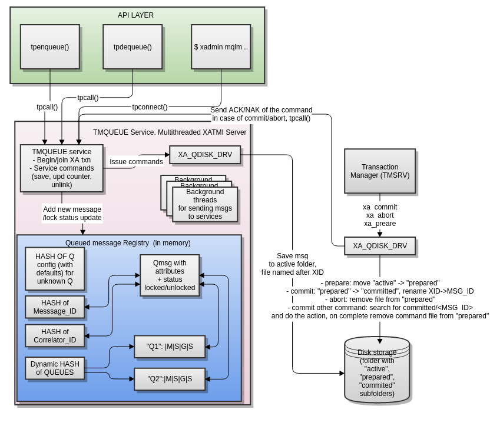

Persistent Message Queues Overview
==================================
Madras Vitolins
v1.0, 2016-05:
	Initial draft
:doctype: book

Persistent queues
-----------------
EnduroX system is built on kernel based real-time IPC queues. Which by definition are not persistent.
When server is restarted, memory data is lost, thus the data in message queues are lost. In some of
the application scenarios persistent messaging is required. Thus EnduroX offers standard ATMI calls
such as 'tpenqueue()' and 'tpdequeue()'. System also supports automatic queues, where messages
are automatically forwarded to configured services.

Messages are stored in file system. To ensure transactional operation, file move/rename is
employed which by it self (in the terms of one file system) is transactional.

The queues are grouped into queue spaces. Queue space grouping element of multiple queue servers.
Queue space basically is service name for backing 'tmqueue' server. Each queue server
can stores it's data in specified file system folders. The 'tmqueue' server works in tandem with
'tmsrv' to ensure the compatibility with global transaction processing.

How the persistent queues work?
-------------------------------
The persistent queues in EnduroX application server are provided by special ATMI server, named
"tmqueue". To start using these queus, firstly you have to configure the 'tmqueue' and paired
'tmsrv'. 

The queue processing can be devided in following steps:

1. 'tmqueue' advertizes queue space services
2. Caller invokes 'tpenqueue()' ATMI API call. This calls the 'tmqueue' server with passed in buffer
data and other flags.
3. 'tmqueue' server recieves the request, saves lookups the queue, and creates the linked list in
memory where to store the message. In the same time message is written to disk in 'active' folder.
Initially message is marked as locked, the message becomes dequeueable at the point when XA 
transaction is committed. At the commit point, the 'tmsrv' with loaded EnduroX queue driver,
completes the message (moves it to 'committed' folder). At the smae point 'tmsrv' sends the notification
to 'tmqueue' to unlock the message. NOTE: It is not possible to enqueue and dequeue same message
in single transaction.
4. When message is unlocked, it is available for 'tpdequeue()'. Where the application invokes this function
and, it calls the 'tmqueue()' for the message. If message is found it again becomes locked, and command
file is issued to disk for message file removal. Once the dequeue transaction is committed, the XA driver
completes the operation, by removing the command file, message file and sending notification back
to 'tmqueue', that command 'REMOVE' is completed. At this point 'tmqueue' server removes the message
completely from memory.
5. In case if queue is defined as 'automatic', the 'forward' threads from 'tmqueue' server
begins sending the message to destination ATMI service. If service call fails, the call is 
retried configured number of times. If call succeeds and reply queue is sent, then message is submitted
to reply queue. If message fails (number of attempts exceeded) and failure queue is defined,
the forwarder thread will submit the message to failure queue. 'TPQCTL' flags in this scenario is
preserved.

Schematically internals of the 'tmqueue' and API works can be displayed as follows:

How to use EnduroX persistent queues
------------------------------------
This section gives some oversight how to use persistent queues. There are two type 
of usages possible. One is that process submits the message to the queue and another
process manually dequeues the message, that is depicted here:

[dia, tpenqueue_tpdequeue.dia, tpenqueue_tpdequeue.png, x300]
-------------------------------
-------------------------------

And another use is that process does 'tpenqueue()' to automatic queue, and message is automatically
forwarded to destination service. The schematics looks like this:

[dia, tpenqueue_auto.dia, tpenqueue_auto.png, x300]
-------------------------------
-------------------------------

For 'tpenqueue()' and 'tpdequeue()' passed in buffers must be allocated with 'tpalloc()'.
For UBF, STRING and JSON buffers, the actual buffer length on enqueue doesn't matter, it is
detected from data data inside. For array buffer, it does play a role. When doing
'tpdequeue()', the the buffer type might be changed, if message have a different data
type.

'tmqueue' ATMI server configuration
-----------------------------------
To configure queue sub-system, you need to start at-least one instance of 'tmqueue' server and
one instance of 'tmsrv'. They both must run in the same XA environment. For running just pure
ATMI client, following entries to 'ndrxconfig.xml' shall be done (serverid and count (min/max) 
can be changed):

---------------------------------------------------------------------
...
        <servers>
            <server name="tmsrv">
                <max>1</max>
                <srvid>1</srvid>
                <sysopt>-e /opt/app1/log/tmsrv.log -r -- -t1 -l/opt/app1/var/RM1</sysopt>
            </server>
            <server name="tmqueue">
                <max>1</max>
                <srvid>100</srvid>
                <sysopt>-e /opt/app1/log/tmqueue.log -r -- -m MYSPACE -q /opt/app1/conf/q.conf -s1</sysopt>
            </server>
        </servers>
...
---------------------------------------------------------------------

From above example it could be seen, that there are no setup for folder where to store
the queue data. Queue folder is setup in in XA open string, thus it goes to
'NDRX_XA_OPEN_STR' and 'NDRX_XA_CLOSE' environment variables.

For example if we are going to store the message data into '/opt/app1/var/MYSPACE' folder, then
XA config looks like this:

---------------------------------------------------------------------
export NDRX_XA_RES_ID=1
export NDRX_XA_OPEN_STR="/opt/app1/var/MYSPACE"
export NDRX_XA_CLOSE_STR=$NDRX_XA_OPEN_STR
# Static registration:
export NDRX_XA_DRIVERLIB=libndrxxaqdisks.so
export NDRX_XA_RMLIB=libndrxxaqdisk.so
export NDRX_XA_LAZY_INIT=1
---------------------------------------------------------------------

In this sample, static registration XA driver (libndrxxaqdisks.so) will be use. Not if 
your application process wants to perform the enqueue in transactional mode, then it must be started
with valid XA environment.

Queue configuration
-------------------
We will configure three queues here. The default queue (recommended), one manual queue
and one automatic queue.  From above 'ndrxconfig.xml' can be seen that queue configuration
is given in '/opt/app1/conf/q.conf' file. 

---------------------------------------------------------------------
@,svcnm=-,autoq=n,tries=0,waitinit=0,waitretry=0,waitretryinc=0,waitretrymax=0,memonly=n
MYQ1,svcnm=-,autoq=n,tries=0,waitinit=0,waitretry=0,waitretryinc=0,waitretrymax=0,memonly=n,mode=fifo
MYQ2,svcnm=TESTSVC,autoq=y,tries=5,waitinit=1,waitretry=10,waitretryinc=5,waitretrymax=30,memonly=n,mode=lifo
---------------------------------------------------------------------

From above sample data, MYQ2 will send messages automatically to "TESTSVC" service, by initially waiting
1 second in queue, if message fails, it it will send it again after 15 (10+5) seconds, if it fails again, 
it will send the message after 20 (10+5+5 as it is try 3) seconds, up till 30 sec max wait time between retries.

Queue 'MYQ1' is defined as manual, and valid only for 'tpdequeue()' call. For manual queues, service name (svcnm)
and wait parameters are not actual.

Sample ATMI client for enqueue & dequeue
----------------------------------------
This section contains C code for ATMI client which enqueues the message to Q and the 
dequeues it.

---------------------------------------------------------------------

/*
  file: qclient.c
*/

#include <string.h>
#include <stdio.h>
#include <stdlib.h>
#include <memory.h>
#include <atmi.h>

#define SUCCEED 0
#define FAIL -1

int main(int argc, char** argv)
{

    int ret = SUCCEED;
    TPQCTL qc;
    int i;

    /* Initial test... */
    for (i=0; i<15; i++)
    {
        char *buf = tpalloc("CARRAY", "", 1);
        char *testbuf_ref = tpalloc("CARRAY", "", 10);
        long len=10;

        printf("loop %d ... ", i);

        testbuf_ref[0]=0;
        testbuf_ref[1]=1;
        testbuf_ref[2]=2;
        testbuf_ref[3]=3;
        testbuf_ref[4]=4;
        testbuf_ref[5]=5;
        testbuf_ref[6]=6;
        testbuf_ref[7]=7;
        testbuf_ref[8]=8;
        testbuf_ref[9]=9;

        /* alloc output buffer */
        if (NULL==buf)
        {
            fprintf(stderr, "tpalloc() failed %s\n", 
                    tpstrerror(tperrno));
            ret = FAIL;
            goto out;
        }

        /* enqueue the data buffer */
        memset(&qc, 0, sizeof(qc));
        if (SUCCEED!=tpenqueue("MYSPACE", "MYQ1", &qc, testbuf_ref, 
                len, TPNOTRAN))
        {
            fprintf(stderr, "tpenqueue() failed %s diag: %ld:%s\n", 
                    tpstrerror(tperrno), qc.diagnostic, qc.diagmsg);
            ret = FAIL;
            goto out;
        }

        /* dequeue the data buffer + allocate the output buf. */

        memset(&qc, 0, sizeof(qc));

        len = 10;
        if (SUCCEED!=tpdequeue("MYSPACE", "MYQ1", &qc, &buf, 
                &len, TPNOTRAN))
        {
            fprintf(stderr, "tpenqueue() failed %s diag: %ld:%s\n", 
                    tpstrerror(tperrno), qc.diagnostic, qc.diagmsg);
            ret = FAIL;
            goto out;
        }

        /* compare - should be equal */
        if (0!=memcmp(testbuf_ref, buf, len))
        {
            fprintf(stderr, "Buffers not equal!\n");
            ret = FAIL;
            goto out;

        }

        printf("ok\n");

        tpfree(buf);
        tpfree(testbuf_ref);
    }
    
    if (SUCCEED!=tpterm())
    {
        fprintf(stderr,"tpterm failed with: %s\n", tpstrerror(tperrno));
        ret=FAIL;
        goto out;
    }
    
out:
    return ret;
}

---------------------------------------------------------------------

The code will be built with following command line (for Linux):

---------------------------------------------------------------------

$ gcc qclient.c -o qcl -l atmiclt -l atmi -l ubf -l nstd -l rt -l dl -l m

---------------------------------------------------------------------

By assuming that runtime is started, we will try to run the tests:

---------------------------------------------------------------------

$ xadmin start -y
EnduroX v2.5.0 alpha, build May 16 2016 12:25:55

Enduro/X Middleware Platform for Distributed Transaction Processing
Copyright (C) 2015, ATR Baltic, SIA. All Rights Reserved.

This software is released under one of the following licenses:
GPLv2 (or later) or ATR Baltic's license for commercial use.

EnduroX back-end (ndrxd) is not running
ndrxd PID (from PID file): 25799
ndrxd idle instance started.
exec tprecover -k 0myWI5nu -i 1 -e  /opt/app1/log/RECOVER -r -- -c10 :
	process id=25800 ... Started.
exec tpevsrv -k 0myWI5nu -i 300 -e  /opt/app1/log/TPEVSRV -r -N -s@TPEVPOST  --  :
	process id=25801 ... Started.
exec atmi.sv1 -k 0myWI5nu -i 1400 -e  /opt/app1/log/ATMISV1 -r --  :
	process id=25802 ... Started.
exec tmsrv -k 0myWI5nu -i 2000 -e  /opt/app1/log/tmsrv.log -r -- -t1 -l/opt/app1/var/RM1 --  :
	process id=25803 ... Started.
exec tmqueue -k 0myWI5nu -i 2010 -e  /opt/app1/log/tmqueue.log -r -- -m MYSPACE -q /opt/app1/conf/q.conf -s1 --  :
	process id=25815 ... Started.
exec cpmsrv -k 0myWI5nu -i 9999 -e  /opt/app1/log/CPMSRV -r -- -i10 -k5 --  :
	process id=25847 ... Started.
Startup finished. 6 processes started.

$ xadmin mqlc
EnduroX v2.5.0 alpha, build May 16 2016 12:25:55

Enduro/X Middleware Platform for Distributed Transaction Processing
Copyright (C) 2015, ATR Baltic, SIA. All Rights Reserved.

This software is released under one of the following licenses:
GPLv2 (or later) or ATR Baltic's license for commercial use.

ndrxd PID (from PID file): 25799
Nd SRVID QSPACE    QNAME     FLAGS QDEF
-- ----- --------- --------- ----- --------------------
1  2010  MYSPACE   @               @,svcnm=-,autoq=n,tries=0,waitinit=0,waitretry=0,waitretryinc=0,waitretrymax=0,mode=fifo
1  2010  MYSPACE   MYQ1            MYQ1,svcnm=-,autoq=n,tries=0,waitinit=0,waitretry=0,waitretryinc=0,waitretrymax=0,mode=fifo
1  2010  MYSPACE   MYQ2            MYQ2,svcnm=TESTSVC,autoq=y,tries=5,waitinit=1,waitretry=10,waitretryinc=5,waitretrymax=30,mode=lifo

$ ./qcl 
loop 0 ... ok
loop 1 ... ok
loop 2 ... ok
loop 3 ... ok
loop 4 ... ok
loop 5 ... ok
loop 6 ... ok
loop 7 ... ok
loop 8 ... ok
loop 9 ... ok
loop 10 ... ok
loop 11 ... ok
loop 12 ... ok
loop 13 ... ok
loop 14 ... ok

---------------------------------------------------------------------

Managing the runtime
--------------------
This section contains overview of the 'xadmin' commands available for queue
management.

From above test session, can be seen how to list the queues, defined in system, by
issuing 'mqlc' (list configuration command). During the normal operations, system administrator might
want to know, how many messages are present currently in queue and what are queue statistics. For this
purpose 'mqlq' (list queues) command can be used.

---------------------------------------------------------------------
$ xadmin mqlq
EnduroX v2.5.0 alpha, build May 16 2016 12:25:55

Enduro/X Middleware Platform for Distributed Transaction Processing
Copyright (C) 2015, ATR Baltic, SIA. All Rights Reserved.

This software is released under one of the following licenses:
GPLv2 (or later) or ATR Baltic's license for commercial use.

ndrxd PID (from PID file): 27208
Nd SRVID QSPACE    QNAME     #QUEU #LOCK #ENQ  #DEQ  #SUCC #FAIL
-- ----- --------- --------- ----- ----- ----- ----- ----- -----
1  2010  MYSPACE   MYQ1      0     0     15    15    0     0    
1  2010  MYSPACE   @         0     0     0     0     0     0    
1  2010  MYSPACE   MYQ2      0     0     0     0     0     0  
---------------------------------------------------------------------

The above listings shows, that from 'MYQ1' 15 messages was enqueued and 15 was dequeued.
In some cases you might want to see the contents of the message in Q (if it is still there).
You may use 'mqdm' (dump message) command. By modifying above example to not to remove messages
from Q. We get following picture:

---------------------------------------------------------------------
$ xadmin mqlq
Nd SRVID QSPACE    QNAME     #QUEU #LOCK #ENQ  #DEQ  #SUCC #FAIL
-- ----- --------- --------- ----- ----- ----- ----- ----- -----
1  2010  MYSPACE   MYQ1      15    0     30    15    0     0    
1  2010  MYSPACE   @         0     0     0     0     0     0    
1  2010  MYSPACE   MYQ2      0     0     0     0     0     0    
---------------------------------------------------------------------

To see the messages in queue, use command 'xadmin mqlm' (list messages):

---------------------------------------------------------------------
NDRX> mqlm -s MYSPACE -q MYQ1
ndrxd PID (from PID file): 27208
Nd SRVID MSGID (STR/Base64 mod)                       TSTAMP (UTC)      TRIES L
-- ----- -------------------------------------------- ----------------- ----- -
1  2010  UcnU2PgOTEqgG1RymbwFdwEA2gcAAAAAAAAAAAAAAAA= 16-05-18 11:55:13 0     N
1  2010  +SFyfn64R9+t9UQKSw5eHwEA2gcAAAAAAAAAAAAAAAA= 16-05-18 11:55:13 0     N
1  2010  94oZ3mwiQaKoEymTzoNiqQEA2gcAAAAAAAAAAAAAAAA= 16-05-18 11:55:13 0     N
1  2010  lFX4KFvSSYy9k2Z3PxkKrQEA2gcAAAAAAAAAAAAAAAA= 16-05-18 11:55:13 0     N
1  2010  9iGWWqBfSFCYwnq1bHgKLAEA2gcAAAAAAAAAAAAAAAA= 16-05-18 11:55:13 0     N
1  2010  rPBQj4kaSEORMbsJxxKikwEA2gcAAAAAAAAAAAAAAAA= 16-05-18 11:55:13 0     N
1  2010  avfiUp5RQr2FgbqwnuB17QEA2gcAAAAAAAAAAAAAAAA= 16-05-18 11:55:13 0     N
1  2010  yTHuuY+cQkCjzKpHjEp1kwEA2gcAAAAAAAAAAAAAAAA= 16-05-18 11:55:13 0     N
1  2010  B4yYdzo5TsGTDS37yY7uHgEA2gcAAAAAAAAAAAAAAAA= 16-05-18 11:55:13 0     N
1  2010  giD1TtTxSjyGlneR0v0WrgEA2gcAAAAAAAAAAAAAAAA= 16-05-18 11:55:13 0     N
1  2010  5T+ePpONSGSFGZ2wwRizOwEA2gcAAAAAAAAAAAAAAAA= 16-05-18 11:55:13 0     N
1  2010  EvtBS42aQcqZxD3AfIwz5gEA2gcAAAAAAAAAAAAAAAA= 16-05-18 11:55:13 0     N
1  2010  mgopJmchTv6YMS4VW68BCwEA2gcAAAAAAAAAAAAAAAA= 16-05-18 11:55:13 0     N
1  2010  KU73LYkWQcCnTQu4OpKCBAEA2gcAAAAAAAAAAAAAAAA= 16-05-18 11:55:13 0     N
1  2010  N4zPeDZ+QaydazuuPzI82QEA2gcAAAAAAAAAAAAAAAA= 16-05-18 11:55:13 0     N
---------------------------------------------------------------------

Lets say, we want to see what is in side of the first message, by using 'mqdm' (dump message) command:

---------------------------------------------------------------------
NDRX> mqdm -n 1 -i 2010 -m UcnU2PgOTEqgG1RymbwFdwEA2gcAAAAAAAAAAAAAAAA=
ndrxd PID (from PID file): 27208
*************** TPQCTL ***************
EX_QFLAGS	0
EX_QPRIORITY	0
EX_QDIAGNOSTIC	0
EX_QURCODE	0
EX_QAPPKEY	0
EX_QDELIVERY_QOS	0
EX_QREPLY_QOS	0
EX_CLTID	
EX_QREPLYQUEUE	
EX_QFAILUREQUEUE	
EX_QDIAGMSG	
EX_QMSGID	Q\c9\d4\d8\f8\0eLJ\a0\1bTr\99\bc\05w\01\00\da\07\00\00\00\00\00\00\00\00\00\00\00\00
EX_QCORRID	
*************** MESSAGE **************
* Buffer type = CARRAY
UBF :4:32427:000:20160518:145737003:d_mqdm.c:0154:Binary message contents
  0000  00 01 02 03 04 05 06 07 08 09                    ..........
NDRX> 

---------------------------------------------------------------------
So above sample does the hex dump of the binary message we enqueued. Lets say
we want to move this message to 'MYQ2' so that processes automatically (currently we do not have TESTSVC
defined. so it will fail. But anyway lets try. To move message, we can use 'mqmv' (move) command.
---------------------------------------------------------------------

NDRX> mqmv -n 1 -i2010 -m UcnU2PgOTEqgG1RymbwFdwEA2gcAAAAAAAAAAAAAAAA= -s MYSPACE -q MYQ2
ndrxd PID (from PID file): 27208
Committed
NDRX> mqlq
ndrxd PID (from PID file): 27208
Nd SRVID QSPACE    QNAME     #QUEU #LOCK #ENQ  #DEQ  #SUCC #FAIL
-- ----- --------- --------- ----- ----- ----- ----- ----- -----
1  2010  MYSPACE   MYQ1      14    0     30    16    0     0    
1  2010  MYSPACE   MYQ2      0     0     1     1     0     1    
1  2010  MYSPACE   @         0     0     0     0     0     0    
NDRX> 
---------------------------------------------------------------------

So after a while, message did fail, it was dequeued and remove.

To remove message from q, it can be 
done by 'mqrm' command, for example:

---------------------------------------------------------------------
NDRX> mqrm -n 1 -i 2010 -m +SFyfn64R9+t9UQKSw5eHwEA2gcAAAAAAAAAAAAAAAA=
ndrxd PID (from PID file): 27208
Succeed
NDRX> mqlq
ndrxd PID (from PID file): 27208
Nd SRVID QSPACE    QNAME     #QUEU #LOCK #ENQ  #DEQ  #SUCC #FAIL
-- ----- --------- --------- ----- ----- ----- ----- ----- -----
1  2010  MYSPACE   MYQ1      13    0     30    17    0     0    
1  2010  MYSPACE   MYQ2      0     0     1     1     0     1    
1  2010  MYSPACE   @         0     0     0     0     0     0   
---------------------------------------------------------------------

So after removal only 13 messages have left in queue.

Runtime queue reconfiguration
-----------------------------
If new queues needs to be defined or parameters of existing queues needs to be changed,
you may use 'mqrc' (reload config) command. This sends request to all 'tmqueue' server to re-read
the config.

Meanwhile you may define new queue during the runtime (with out changing the config) or update existing one.
Lets say we want to change 'MYQ2' to manual queue. You may do this in following way by using
'mqch' (change) command:

---------------------------------------------------------------------

NDRX> mqch -n 1 -i 2010 -qMYQ2,autoq=n
ndrxd PID (from PID file): 27208
Succeed
NDRX> mqlc
ndrxd PID (from PID file): 27208
Nd SRVID QSPACE    QNAME     FLAGS QDEF
-- ----- --------- --------- ----- --------------------
1  2010  MYSPACE   @               @,svcnm=-,autoq=n,tries=0,waitinit=0,waitretry=0,waitretryinc=0,waitretrymax=0,mode=fifo
1  2010  MYSPACE   MYQ1            MYQ1,svcnm=-,autoq=n,tries=0,waitinit=0,waitretry=0,waitretryinc=0,waitretrymax=0,mode=fifo
1  2010  MYSPACE   MYQ2            MYQ2,svcnm=TESTSVC,autoq=n,tries=5,waitinit=1,waitretry=10,waitretryinc=5,waitretrymax=30,mode=lifo

---------------------------------------------------------------------

Further study
-------------
For more use cases the 'atmitests/test028_tmq' can be analyzed. It contains test cases for supported
EnduroX duarble queue functionality.

:numbered!:

[bibliography]
Additional documentation 
------------------------
This section lists additional related documents.

[bibliography]
.Internet resources
- [[[ATMI-API]]] http://docs.oracle.com/cd/E13203_01/tuxedo/tux71/html/pgint6.htm
- [[[FML-API]]] http://docs.oracle.com/cd/E13203_01/tuxedo/tux91/fml/index.htm
- [[[XADMIN-MANPAGE]]] man xadmin
- [[[Q.CONF-MANPAGE]]] man q.conf
- [[[TMQUEUE-MANPAGE]]] man tmqueue

[glossary]
Glossary
--------
This section lists

[glossary]
ATMI::
  Application Transaction Monitor Interface

UBF::
  Unified Buffer Format it is similar API as Tuxedo's FML

////////////////////////////////////////////////////////////////
The index is normally left completely empty, it's contents being
generated automatically by the DocBook toolchain.
////////////////////////////////////////////////////////////////
